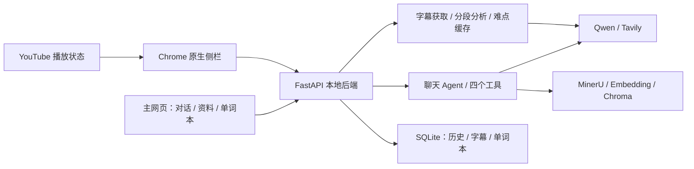

# 语境 · English Usage Coach

**真实英文内容中的语境表达学习助手。** 阅读时主动提问与追问，观看 YouTube 时在 Chrome 原生侧栏获得少量难点解释，通过单词本保存原句和出处，继续深入学习。

> **产品第二版 v2** · 程序 **v0.2.0** · 展示材料版 1.2 · 更新 2026-10-10

## 两条案例阅读路径

同一产品、同一代码仓库，分别呈现工程实现与产品工作。两条路径共用真实演示与验证记录。

| 路径 | 阅读顺序 | 重点 |
| --- | --- | --- |
| **AI Agent 工程案例** | [工程案例](docs/engineering-case-study.md) → [API 与数据流程](docs/api.md) → [测试与证据](docs/verification.md) → [源代码](english_coach/runtime.py) → 本页运行说明 | 架构、四个工具、RAG、SQLite/Chroma、REST/NDJSON、字幕固定流程、缓存与异常恢复 |
| **AI 产品案例** | [产品案例](docs/product-case-study.md) / [案例 PDF](output/pdf/english-usage-coach-case-study.pdf) → [真实演示](docs/demo.md) → [完整 PRD](docs/prd.md) → [Figma 与设计说明](docs/prototype/README.md) → [AI 评估](docs/ai-evaluation.md) / [验收矩阵](docs/verification.md) | 问题、用户任务、定位、优先级、流程、交互状态、AI 质量与迭代 |

设计入口：[原生 Figma Design](https://www.figma.com/design/SSKWRf7RIyYh62SzvAtjHX) · [学习对话原型](https://www.figma.com/proto/SSKWRf7RIyYh62SzvAtjHX?node-id=4-35&starting-point-node-id=4%3A35&scaling=scale-down&content-scaling=fixed) · [视频伴学原型](https://www.figma.com/proto/SSKWRf7RIyYh62SzvAtjHX?node-id=4-54&starting-point-node-id=4%3A54&scaling=scale-down&content-scaling=fixed) · [本地 HTML 原型](docs/prototype/index.html)。本地 HTML 使用原生导出和同源连接，下载仓库后打开；GitHub 可直接阅读文档与图片。

版本入口：[第二版展示材料 Release](https://github.com/ianlee001/english-usage-coach/releases/tag/v2-showcase-20261010) · [原 v0.2.0 Release](https://github.com/ianlee001/english-usage-coach/releases/tag/v0.2.0) · [v1 标签](https://github.com/ianlee001/english-usage-coach/tree/v0.1.0) · [版本变化](CHANGELOG.md)。本次增加完整案例与设计交付，程序仍为 v0.2.0；原有标签及代码历史保留。

本人负责需求定义、产品方案、核心业务逻辑设计与落地、接口和数据组织方案、实际试用及迭代；AI 辅助前端代码生成及代码检查、测试与验收。视频交互参考 Relingo，结合 Agent／RAG 学习实践完成。

**当前保存规则：实际展示后自动记录，收藏标记重点。** 图片提问属于后续扩展；当前多模态模型配置不代表已交付图片上传或视频画面理解。原生 Figma 已完成 35 个当前状态与 2 个独立探索画板、主要交互连接及页面导出；HTML 使用同源原生 SVG 和实际连线热点。


图像用途、v1 资料/对话证据与验证范围见演示页。GitHub 可直接阅读 Markdown 与图片；HTML 交互需下载后打开，尚未部署在线服务。代码沿用同一仓库升级为 v2，保留 [v1 演示](docs/demo-v1.md) 与版本历史。

## 技术架构

Python 3.13 + uv + FastAPI REST 后端 + 原生 HTML/CSS/JavaScript 主网页 + Chrome Manifest V3 侧栏扩展。

已从 Streamlit 迁移。原来的聊天、聊天历史、上传资料 RAG 保留；新增视频难点伴学、自动保存的单词本、收藏和已掌握状态。没有 MCP、React、Redis、Celery，也不需要 Node.js 来运行产品。



## 1. 现在有哪些功能

- **学习对话**：中文讲解、英文例句、流式回答、SQLite 历史、按需调用资料检索/联网搜索/单词本/视频语境工具。
- **学习资料**：TXT/MD 本地解析，PDF/DOCX 用 MinerU；分块、Embedding、Chroma 持久化；回答保留来源。
- **视频伴学**：Chrome 原生侧栏，自动识别正在看的 YouTube 普通视频。优先人工英文字幕，否则尝试自动英文字幕。按英语水平筛选少量难点，普通句子不显示卡片。
- **难点卡片**：表达、语境含义、短说明；原句和翻译默认折叠；支持重播这句、收藏、已掌握。
- **单词本**：只自动保存实际播放时显示过的难点。提前分析只是缓存，拖动跳过的内容不会批量加入。可按表达/中文含义、视频、状态、收藏筛选；回到视频对应时间复习。
- **字幕后备导入**：YouTube 获取失败时，在主网页导入该视频对应的 UTF-8 英文 SRT/VTT。

模型沿用 `qwen3.8-omni-flash`，Embedding 沿用 `tongyi-embedding-vision-flash`。字幕难点分析直接调用文本模型，不使用音频、视频流或 Embedding。中文解释由 Qwen 生成；当前版本没有额外抓取 YouTube 中文自动翻译。

## 2. 安装与启动（Windows）

先安装 Git 和 uv。首次下载项目，在 PowerShell 执行：

```powershell
git clone https://github.com/ianlee001/english-usage-coach.git
cd english-usage-coach
uv sync --locked --python 3.13
```

如果 uv 找不到你安装的 Python，可指定本机解释器路径，例如：

```powershell
uv sync --locked --python D:\python\python.exe
```

**已有 `.env` 就继续使用，不要覆盖。** 第一次配置时，复制 `.env.example` 为 `.env`，保存在本目录，与 `pyproject.toml` 同级。

必填/按功能填写：

| 变量 | 用途 |
| --- | --- |
| `DASHSCOPE_API_KEY` | 聊天、字幕难点分析、Embedding |
| `DASHSCOPE_BASE_URL` | 百炼业务空间的 OpenAI 兼容根地址，通常以 `/compatible-mode/v1` 结尾 |
| `LLM_MODEL` | 默认 `qwen3.8-omni-flash` |
| `EMBEDDING_MODEL` | 默认 `tongyi-embedding-vision-flash` |
| `DASHSCOPE_EMBEDDING_ENDPOINT` | 官方地址可自动推导；自定义网关时显式填写原生多模态向量接口 |
| `TAVILY_API_KEY` | 只有联网搜索需要 |
| `MINERU_TOKEN` | PDF/DOCX 的 MinerU precision 解析需要 |

`.env.example` 中还有维度、分块、上传大小和超时设置。系统环境变量优先于 `.env`；修改后重启服务。

检查配置并启动：

```powershell
uv run --locked python check_setup.py
uv run --locked python -m backend.server
```

也可以双击 **`start_app.bat`**。启动后打开：

**http://127.0.0.1:8000**

`uv run --locked python app.py` 也可启动同一个新后端。旧命令 `streamlit run app.py` 已不再适用。

保持终端运行，`Ctrl+C` 停止。主网页可以关闭，扩展仍能访问运行中的后端。若 8000 被占用，可在当前 PowerShell 设置端口：

```powershell
$env:COACH_PORT = "8008"
uv run --locked python -m backend.server
```

然后主网页和扩展都改用 `http://127.0.0.1:8008`。当前版本只支持本机单用户、单进程运行，请勿添加 `--workers` 或对公网暴露。

## 3. 在 PyCharm 中打开

1. `File → Open`，选择克隆得到的 `english-usage-coach` 文件夹，确认其中有 `pyproject.toml`。
2. 在 PyCharm Terminal 中执行 `uv sync --locked --python 3.13`。
3. `Settings → Project → Python Interpreter → Add Interpreter → Existing`，选择项目的 `.venv\Scripts\python.exe`。
4. 创建 Python 运行配置：运行类型选 **Module name**，填写 `backend.server`；工作目录为项目根目录。
5. 点击运行，浏览器打开 `http://127.0.0.1:8000`。
6. 前端是普通静态文件，不需要 npm install。改 HTML/CSS/JS 后刷新页面；改 Python 后重启服务。

## 4. 安装 Chrome 侧栏扩展

只需做一次：

1. 启动后端，并打开主网页。
2. 在 Chrome 地址栏输入 `chrome://extensions`。
3. 打开右上角“开发者模式”，点击“加载已解压的扩展程序”。
4. 选择项目根目录中的 **`extension`** 文件夹。
5. 将“语境 · YouTube 难点伴学”固定到工具栏。
6. 在主网页进入“视频伴学”，点击“显示连接码”并复制。
7. 打开 YouTube 页面，点击扩展图标；在侧栏“连接设置”填写服务地址和连接码，点击“保存并连接”。
8. **刷新安装扩展前已经打开的 YouTube 页面。** 更新扩展代码后，也要在扩展管理页点击重新加载，再刷新 YouTube。

Chrome 的设置决定原生侧栏出现在左边还是右边。需要右侧时在浏览器设置中选择右侧。扩展不是播放器全屏中的悬浮层，当前版本请使用普通观看模式。

连接码是本地服务的凭证，不是百炼 API Key；生成在 `data/local_api_token.txt`（或你的自定义 DATA_DIR），不要提交到 Git。丢失时可回主网页重新查看。更换电脑或删除此文件后需要重新配对。扩展不会读取或存储百炼密钥。

## 5. 每次怎样使用视频伴学

1. 运行 `start_app.bat` 或启动 PyCharm 后端配置。
2. 打开一个 YouTube 普通英语视频（`https://www.youtube.com/watch?v=...`）。
3. 点击扩展，设置初级/中级/高级，点击“开始伴学”。
4. 程序获取全文英文字幕，在后台分析当前分钟和下一分钟，之后跟随播放滚动准备。首段可能需要等待模型响应，来不及显示的片段可回放。
5. 只有播放到难点时才出现卡片，并自动加入单词本；侧栏“单词本”按钮可打开主网页。
6. 可以暂停伴学；再次开始会复用字幕和已完成的分析缓存。切换视频或标签页会停止当前伴学，防止把别的视频时间套进旧字幕。
7. 当前版本每分钟最多生成 3 个难点，同一轮伴学中同一表达不重复提示，已标记掌握的表达会过滤。模型只是估计难度。

关闭主网页不会停止后端。关闭侧栏会停止后续请求；已经发出的模型请求可能完成并留下缓存，但不会把尚未展示的难点加入单词本。服务重启后旧会话会暂停，需要重新点击开始。

字幕不能自动获取时：在主网页“视频伴学”底部输入视频链接/ID，选择对应英文 SRT/VTT 导入，然后重新开始伴学。导入字幕应对应原视频时间轴。

限制：当前版本不处理直播、Shorts、无字幕视频、烧录在画面里的硬字幕、语音识别或多模态画面理解。自动字幕可能转写错误，解释不一定准确。`youtube-transcript-api` 依赖非公开网站接口，网络/平台改动/请求限制可能使个别视频无法获取；导入字幕入口可继续使用。浏览器能访问 YouTube 不一定代表 Python 进程也能访问，请检查本机网络配置。

## 6. 文件结构与作用

```text
english-usage-coach/
├─ app.py                     # 兼容入口，转到 FastAPI 启动器
├─ backend/
│  ├─ __init__.py
│  └─ server.py               # REST、聊天流、认证、中间件、后台任务生命周期
├─ frontend/
│  ├─ index.html              # 主网页四个区域：聊天/单词本/资料/伴学设置
│  ├─ styles.css              # 主网页样式与响应式布局
│  └─ app.js                  # 接口调用、聊天流渲染、筛选、收藏和导入
├─ extension/
│  ├─ manifest.json           # Chrome 扩展声明、权限、页面脚本
│  ├─ background.js           # 侧栏入口和受信任扩展存储
│  ├─ content.js              # 读取 YouTube 播放状态、定位重播
│  ├─ core.js                 # 播放/跳转判断和难点触发的纯逻辑
│  ├─ sidepanel.html          # 侧栏界面
│  ├─ sidepanel.css           # 侧栏样式
│  └─ sidepanel.js            # 配对、会话、轮询、卡片和自动保存
├─ english_coach/
│  ├─ config.py               # .env 配置、路径和安全错误信息
│  ├─ runtime.py              # 聊天 Agent、调用次数限制、历史与失败恢复
│  ├─ prompts.py              # 英语教学及资料使用规则
│  ├─ tools.py                # 资料、联网、单词本、视频语境四个工具
│  ├─ storage.py              # 原有聊天与文档目录 SQLite 表
│  ├─ learning.py             # 字幕/会话/缓存/单词本/视频出处 SQLite 表
│  ├─ video.py                # 字幕获取与解析、难点分析、后台任务和缓存
│  ├─ knowledge.py            # MinerU、分块、Chroma 入库与检索
│  └─ embeddings.py           # 百炼原生多模态 Embedding 适配
├─ tests/                     # Python 集成测试与 Node 扩展逻辑测试
├─ examples/                  # 可用于资料导入的示例笔记
├─ docs/
│  ├─ engineering-case-study.md # AI Agent 工程案例：架构、数据与可靠性
│  ├─ api.md                  # 接口和数据流程说明
│  ├─ verification.md         # 需求、验收与证据对应及验证范围
│  ├─ demo.md                 # 对话、资料、视频与单词本的真实演示
│  ├─ demo-v1.md              # 第一版 Streamlit 演示存档
│  ├─ ai-evaluation.md        # AI 评分标准、具体模拟样例与指标分析
│  ├─ product-case-study.md   # 公开产品案例：问题、方案、取舍和真实成果
│  ├─ prd.md                  # 功能规则、状态、异常、验收及后续改进
│  ├─ prototype/              # 原生 Figma、交互入口、原生导出与设计说明
│  └─ streamlit_readme.md     # 迁移前 README 存档
├─ output/pdf/                # 独立发送的项目案例 PDF
├─ CHANGELOG.md               # 版本变化与升级说明
├─ .env.example               # 配置模板；真实 .env 不提交
├─ .python-version            # Python 3.13
├─ pyproject.toml             # uv 依赖与测试工具配置
├─ uv.lock                    # 锁定的依赖版本
├─ check_setup.py             # 离线配置检查，不显示密钥
└─ start_app.bat              # Windows 启动脚本
```

运行产生 `data/`、`uploads/`、`.venv/`，均已忽略。后端同时提供前端静态文件与 `/api/`，代码分层、数据走 REST，本地不需要另开一个前端开发服务器。

## 7. 数据迁移与机制

首次启动新后端时，会把已有 `catalog.sqlite`、`checkpoints.sqlite` 一致性备份到 `data/backups/before_web_migration/`，随后增量建表。保留原聊天、文档和 Chroma；不会主动清空数据库。请继续使用原有 DATA_DIR、UPLOAD_DIR 和 Embedding/分块配置。

- `catalog.sqlite`：聊天显示记录、文档目录，以及新的视频/单词本表。
- `checkpoints.sqlite`：Agent 内部对话状态。
- `chroma/`：资料向量索引；更换向量模型/维度不能混用旧索引。
- 模型与工具调用有每轮次数上限。字幕分析是固定 Python 流程，不经过自由工具循环。
- 相同英文表达和相同中文含义才合并为一个单词本条目；不同语境保留来源，不做不可靠的自动词义合并。
- 分析缓存按视频、字幕版本、难度、模型及分析版本区分；缓存里的空结果也会保留，避免反复分析普通句子。
- API 记录请求编号、路径、状态和耗时，不记录密钥或完整字幕。
- 网页使用同源请求和 HttpOnly cookie；扩展通过本地主机权限和 Bearer 连接码访问。未开放任意来源 CORS，也没有完整账号体系。
- 聊天使用 HTTP NDJSON 流返回文本，其他功能使用 JSON REST；扩展每 2 秒取结果，播放时间在浏览器本地判断，不需要 WebSocket。

## 8. 测试

```powershell
uv run --locked pytest -q
uv run --locked ruff check .
uv run --locked ruff format --check .
```

有 Node.js 时可以额外运行扩展纯逻辑测试（产品运行不需要 Node）：

```powershell
node --test tests/extension_core.test.cjs
```

测试使用临时数据库和模拟模型，不调用你的付费模型。真实服务的验证范围见 [docs/verification.md](docs/verification.md)。接口清单见 [docs/api.md](docs/api.md)；机器可读规范为 `http://127.0.0.1:8000/openapi.json`。
