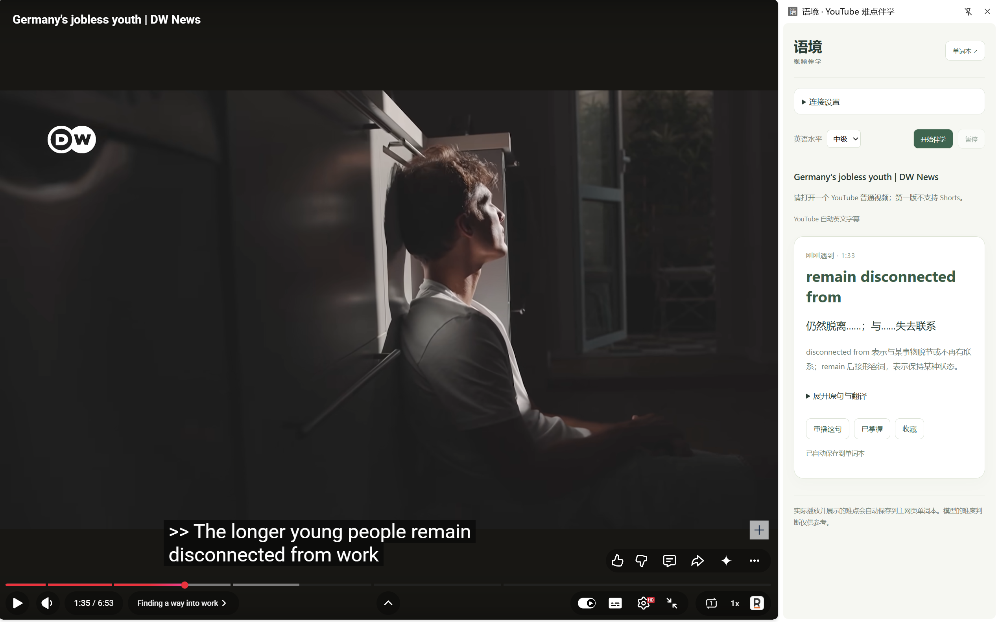
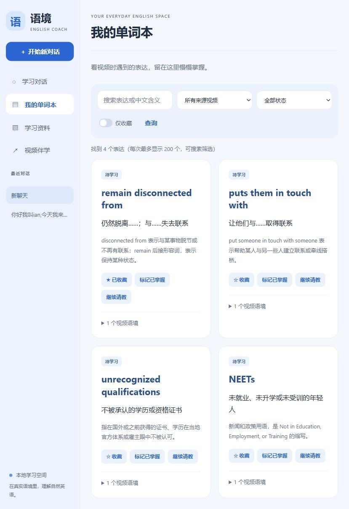
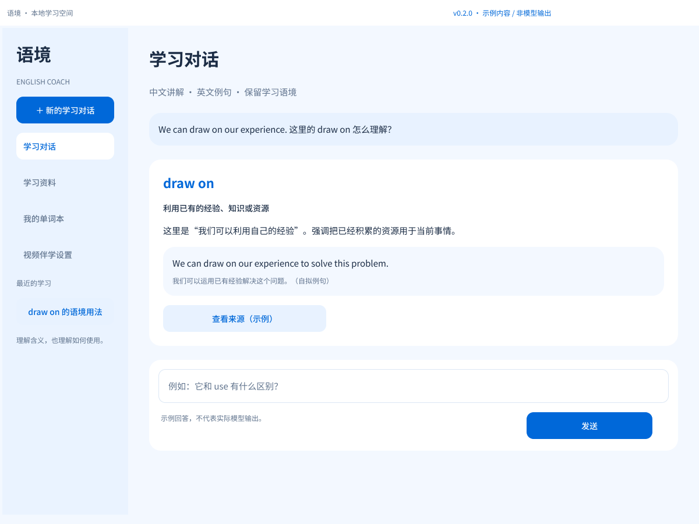
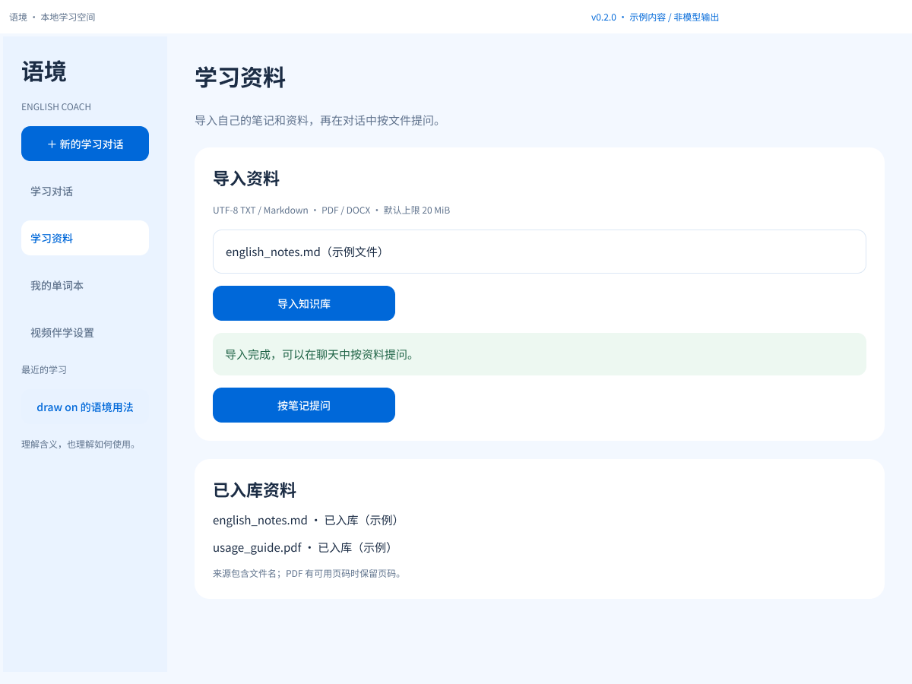
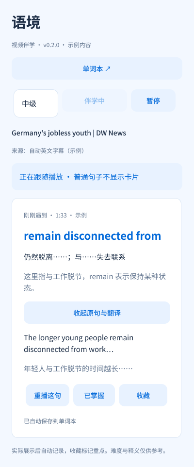

# 语境 · English Usage Coach｜实际运行演示

> 产品第二版 v2 · 程序 v0.2.0 · 更新 2026-10-10

[项目首页](../README.md) · [工程案例](engineering-case-study.md) · [项目案例](product-case-study.md) · [PRD](prd.md) · [验证与验收](verification.md) · [第一版演示存档](demo-v1.md)

本页按对话、资料、视频与回顾任务组织真实使用证据。视频截图由使用者提供；单词本截图于 2026-10-07 从正在运行的本地主网页截取，使用已有学习记录，没有为展示生成虚拟数据。

## 1. 学习对话：主动提问并继续学习

2026-09-28 的真实对话从“今天学习实用英语表达”开始，按场景给出英文表达与中文说明；后续提问涉及 `based` 用法、网络引用与多轮上下文。

## 2. 学习资料：导入个人资料并核对依据

同日导入的一份 PDF 显示 85 个片段。询问“2.3 时态问题主要讲的是什么”后，回答给出文件与第 14–16 页的来源线索。

前两节保留 v1 功能验证历史。v2 延续对话、资料与历史能力，使用新的浅蓝网页界面；当前设计见 [交互材料](prototype/README.md)。完整提问、来源映射及其他截图见 [v1 演示存档](demo-v1.md)。

## 3. 看 YouTube，在原生侧栏理解难点

视频为 **Germany's jobless youth | DW News**。使用者提供的截图中，播放器位于约 1:35，右侧显示 1:33 附近的表达：

- **remain disconnected from**：仍然脱离……；与……失去联系。
- 卡片给出简短用法说明，原句与翻译默认折叠。
- 提供“重播这句”“已掌握”“收藏”，下方显示“已自动保存到单词本”。
- 页面标注字幕来源为“YouTube 自动英文字幕”。

这张图拍摄于浅蓝配色调整前，保留了当时的绿色界面；当前代码中的主网页和侧栏均已调整为浅蓝风格。图中播放器处于暂停画面，截图用于展示实际卡片、字幕来源标识及保存反馈，不单独证明持续播放同步、跳转或暂停行为的全过程。

视频画面属于原视频发布者，本仓库仅用界面截图说明伴学功能，不包含视频文件。

## 4. 回到主网页，在单词本复习

以下为当前浅蓝配色主网页的实际截图。页面显示 4 个已保存表达，来源筛选中可见上述 DW News 视频：

| 表达 | 本次保存的语境含义 |
| --- | --- |
| remain disconnected from | 仍然脱离……；与……失去联系 |
| puts them in touch with | 让他们与……取得联系 |
| unrecognized qualifications | 不被承认的学历或资格证书 |
| NEETs | 未就业、未升学或未受训的年轻人 |

第一张卡片已收藏。每张卡片都有“标记已掌握”“继续请教”和视频语境展开入口；顶部可以搜索、按来源视频和学习状态筛选，或只看收藏。截图中的释义是本次模型输出，并非逐条经过独立语言学审校。

聊天、历史和资料 RAG 仍从左侧导航进入。第一版的对话、PDF 检索和上下文案例保留在[旧版演示](demo-v1.md)，其中界面为旧 Streamlit 版本。

## 5. 原生设计与交互预览

真实截图保留实际输出与版本；设计稿用于展示统一后的浅蓝界面、状态和恢复交互，内容统一标为示例。

- [原生 Figma 文件](https://www.figma.com/design/SSKWRf7RIyYh62SzvAtjHX)：35 个当前状态，2 个独立探索画板，基础组件与 Auto layout。
- [学习对话交互原型](https://www.figma.com/proto/SSKWRf7RIyYh62SzvAtjHX?node-id=4-35&starting-point-node-id=4%3A35&scaling=scale-down&content-scaling=fixed)；[视频伴学交互原型](https://www.figma.com/proto/SSKWRf7RIyYh62SzvAtjHX?node-id=4-54&starting-point-node-id=4%3A54&scaling=scale-down&content-scaling=fixed)。
- [页面导出与使用说明](prototype/README.md)；[本地交互预览](prototype/index.html)。

图片提问和保存就地重试放在独立探索页，未计入当前运行功能。收藏或掌握后保留侧栏状态反馈，点击单词本才进入主网页。

## 6. 运行体验路径

1. 按 [README](../README.md) 配置 `.env`，启动本地后端。
2. 在 Chrome 加载项目的 `extension/`，通过主网页的“视频伴学”取得连接码并配对。
3. 打开有英文字幕的 YouTube 普通视频，选择英语水平，点击“开始伴学”。
4. 播放到模型筛出的难点时查看侧栏卡片；首段分析需要时间，错过后可回放。
5. 打开单词本，确认刚刚显示的表达及视频出处，再使用收藏、已掌握和继续请教。

不同视频、英语水平和模型输出会产生不同结果，不保证复现完全相同的表达。当前只处理可获取的英文字幕；抓取失败时可在主网页导入对应的英文 SRT/VTT。没有字幕的音视频识别不在本版范围内。

实现与验证范围见 [接口文档](api.md) 和 [验证记录](verification.md)。本仓库只包含演示图片，不包含使用者的数据库、上传资料、密钥或扩展连接码。
