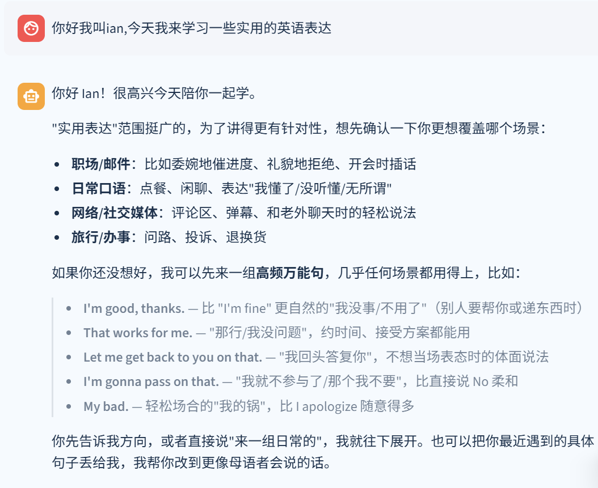
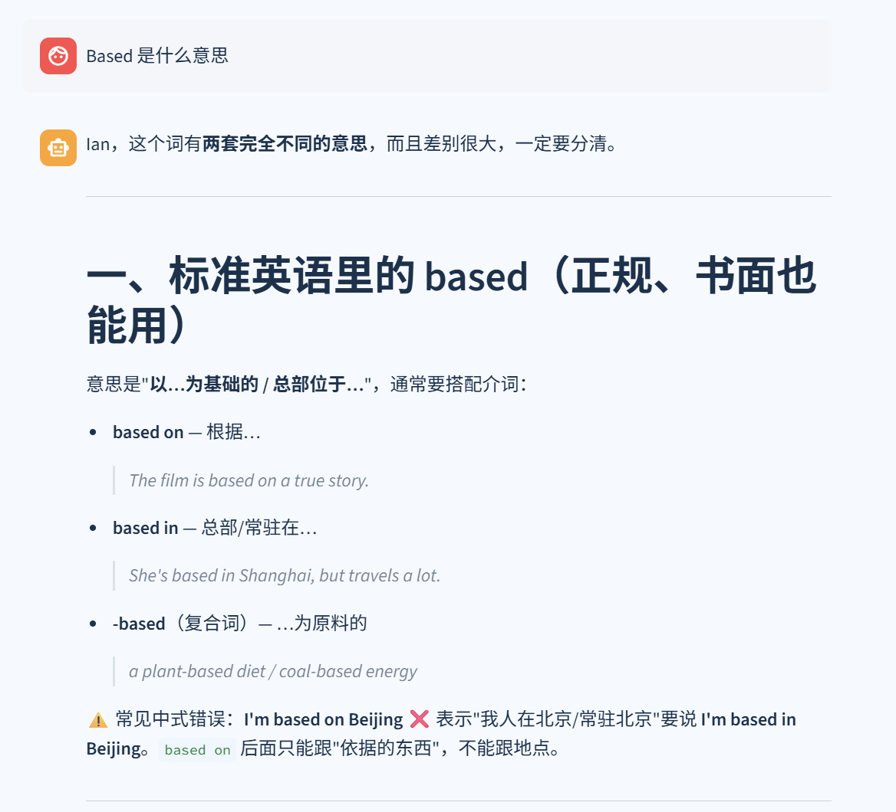
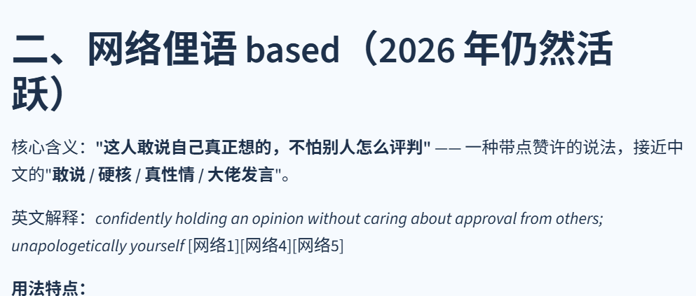
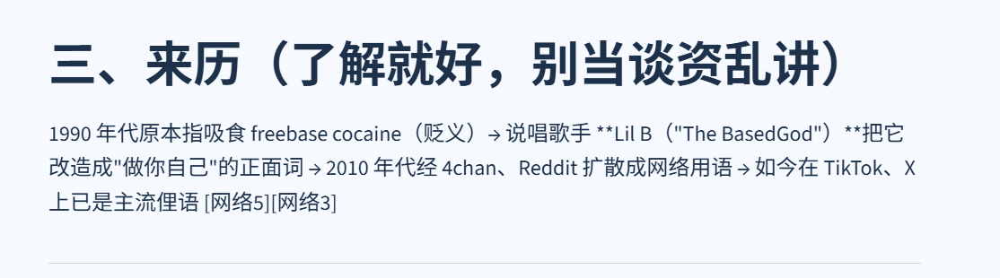
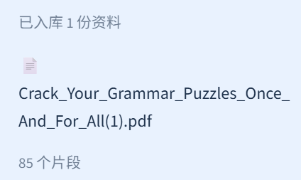
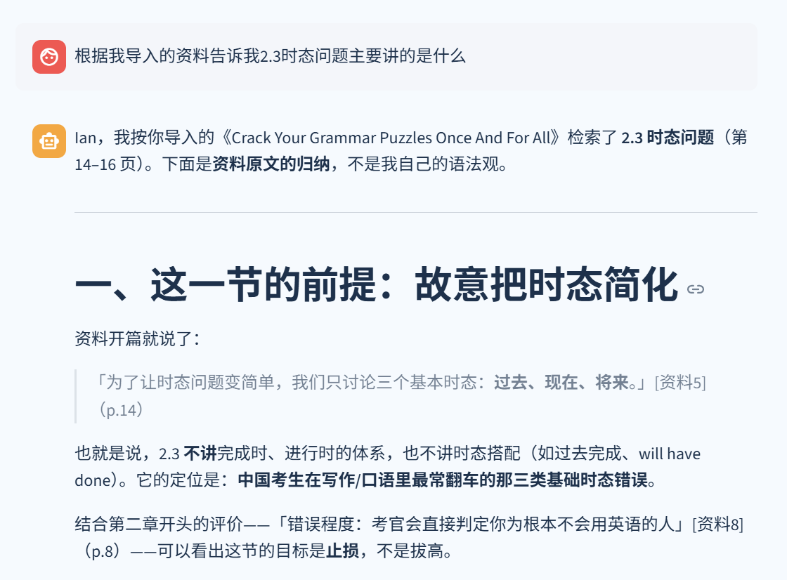
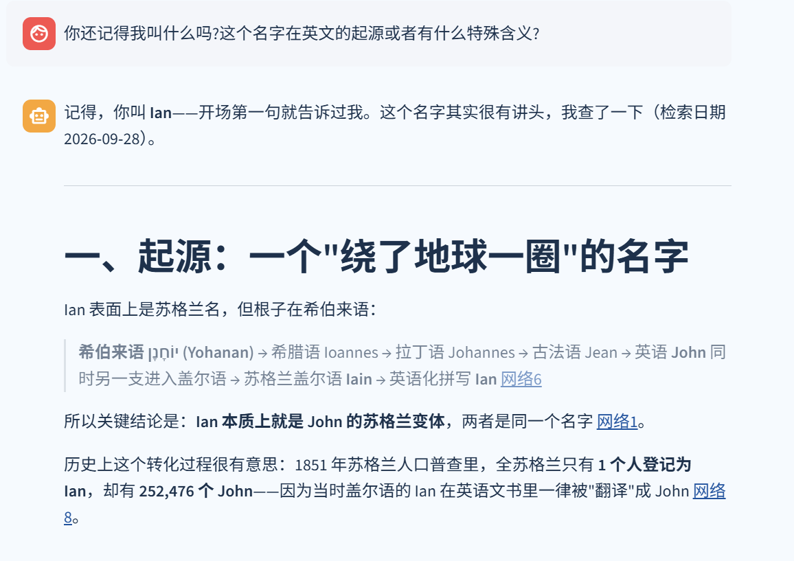
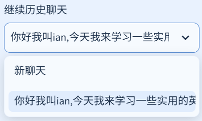

# 实际运行演示

[返回项目首页](../README.md)

本页整理了 2026-09-28 的真实本地测试。截图来自使用者提供的界面截屏，文字节选与本地已完成会话核对一致，没有为展示重新生成答案。截图中的 Ian 是这次会话中输入的称呼。

这些案例展示系统的交互、检索和来源呈现方式。截图中的语言判断、词源和热度描述保留当时模型的原始输出，不代表逐条经过人工事实核验；一次成功回答也不等于系统的整体准确率。

## 1. 日常英语学习：从学习目标进入问答

**实际输入**

> 你好我叫ian,今天我来学习一些实用的英语表达

**回答节选**

> - **That works for me.** — "那行/我没问题"，约时间、接受方案时用
> - **Let me get back to you on that.** — "我回头答复你"，不想当场表态时的体面说法

系统先询问职场、日常、网络或旅行等使用场景，再给出英文表达、中文含义和使用情境。

## 2. 联网搜索：区分普通词义与网络用法

**实际输入**

> Based 是什么意思

回答先解释 `based on`、`based in` 和 `-based` 等用法，再单独讨论网络俚语。该轮保存的来源记录包含 5 个网页条目，回答中可见 `[网络1]` 等引用编号。

**回答节选**

> 核心含义：**"这人敢说自己真正想的，不怕别人怎么评判"** —— 一种带点赞许的说法，接近中文的"**敢说 / 硬核 / 真性情 / 大佬发言**"。

查看该轮引用的部分网页记录与补充截图

以下是当时工具返回并保存的链接，仅用于追踪该次回答的来源，没有复制网页全文，也没有在本次整理中重新执行搜索。

| 引用编号 | 当时记录的网页 |
|---|---|
| 网络1 | [Based Meaning Slang](https://punsmarkete.com/based-meaning-slang) |
| 网络4 | [Based Meaning in Text](https://nsfwmeanings.com/based-meaning) |
| 网络5 | [Based Meaning Slang (2025)](https://allsimiles.com/based-meaning-slang) |

检索记录日期为 2026-09-28。搜索命中并不能单独证明表达的普及程度；来源质量与回答中的绝对化表述仍需进一步评估。

## 3. 文档 RAG：上传 PDF 后按章节提问

**导入状态**

截图显示一份 PDF 已入库，生成 **85 个片段**。这个数字是该文件本次解析和切分的结果，不是页数或性能指标。

**实际输入**

> 根据我导入的资料告诉我2.3时态问题主要讲的是什么

**回答开头节选**

> Ian，我按你导入的《Crack Your Grammar Puzzles Once And For All》检索了 **2.3 时态问题**（第 14–16 页）。下面是**资料原文的归纳**，不是我自己的语法观。

回答随后分条归纳过去时、一般现在时和将来时的错误点，并给出资料编号及页码。下图展示回答开头和引用格式。

从该轮保存的来源记录中，可以核对以下映射：

| 回答引用编号 | 文件 | PDF 页码 |
|---|---|---|
| 资料5 | Crack_Your_Grammar_Puzzles_Once_And_For_All(1).pdf | 14 |
| 资料10 | 同上 | 15 |
| 资料13 | 同上 | 16 |

这里只展示少量回答节选和引用元数据。原始 PDF、完整解析文本、向量库与聊天数据库均未加入仓库。仓库中的示例笔记可用于复现同类检索流程，但不会复现这份 PDF 的章节内容和页码。

## 4. 多轮上下文与历史会话入口

在开场介绍名字、询问词义和 PDF 内容之后，使用者继续提问：

> 你还记得我叫什么吗?这个名字在英文的起源或者有什么特殊含义?

**回答开头节选**

> 记得，你叫 **Ian**——开场第一句就告诉过我。

侧栏也提供“继续历史聊天”的选择入口：

这两张截图分别展示上下文承接和历史会话入口；它们本身不记录停止进程、重启和恢复的全过程。SQLite 持久化实现见 [storage.py](../english_coach/storage.py) 和 [runtime.py](../english_coach/runtime.py)，会话相关测试见 [test_agent_ui.py](../tests/test_agent_ui.py)。

## 在自己的电脑上体验

先按 [README 启动说明](../README.md) 安装依赖并配置自己的 `.env`。以下是复现操作与观察点，不是本次测试的新增实测结果。

| 步骤 | 操作或提问 | 观察点 |
|---|---|---|
| 1 | 上传仓库的 `examples/english_notes.md`，点击“导入选中的资料” | 出现成功入库的资料条目 |
| 2 | `根据 english_notes.md 解释 draw on，并引用资料。` | 回答含资料中的“利用已有知识、经验或资源”义项，可展开来源查看文件名和原文片段 |
| 3 | `请再给我一个职场场景的例句。` | 能承接上一轮表达；新编例句应与资料原句区分 |
| 4 | `根据这份笔记解释 quantum banana。` | 说明资料没有该表达，避免编造文档依据 |
| 5 | 在同一聊天里介绍一个称呼，之后询问 `你还记得我叫什么吗？` | 能利用同一会话的上下文回答 |
| 6 | 停止程序，再用同一数据目录启动，选择原会话继续提问 | 历史消息可见，上下文可以继续 |

如果要体验 PDF 页码引用，可自行上传一份允许使用的 PDF。Markdown 示例没有 PDF 页码，来源应展示文件名及可用章节信息。

本页的 8 张图片都是提供的原始截屏，按用途重命名，未修改图片内的回答。仓库无需包含个人数据库，访客也能直接在 GitHub 阅读这些案例。
