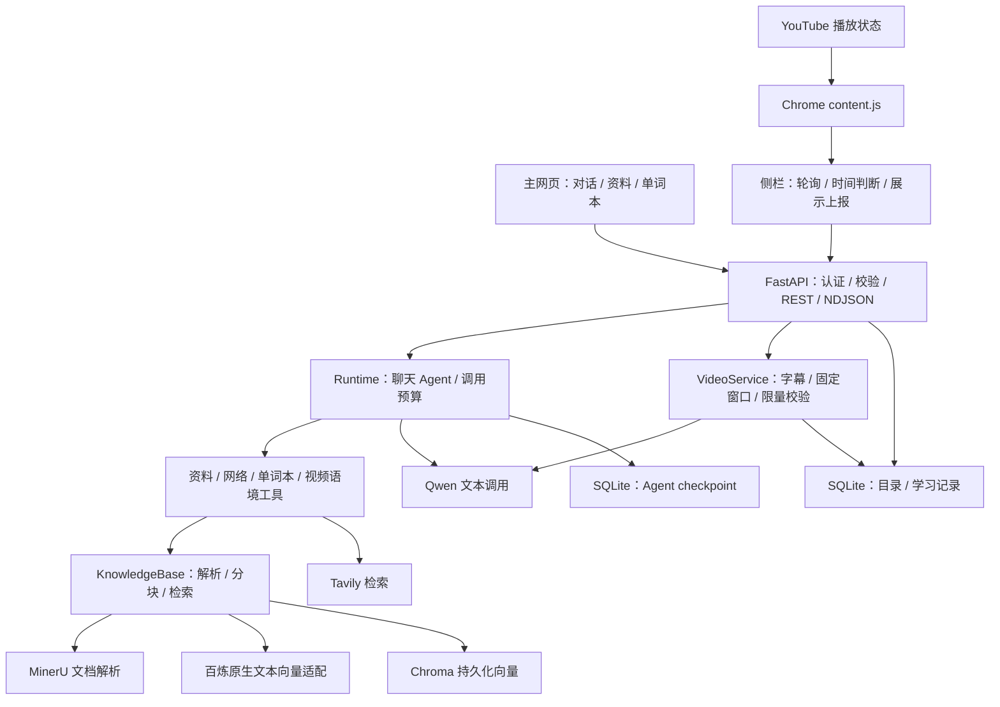
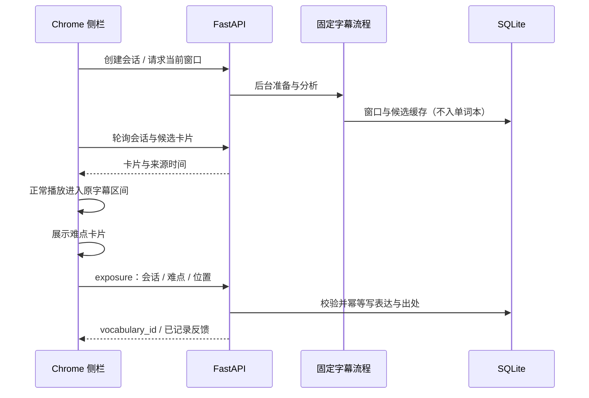

# 语境 · English Usage Coach｜AI Agent 工程案例

> 产品第二版 v2 · 程序 v0.2.0 · 文档版 1.2 · 2026-10-10

[项目首页](../README.md) · [接口文档](api.md) · [测试与证据](verification.md) · [真实演示](demo.md) · [产品案例](product-case-study.md)

## 工程概览

语境将开放式英语问答与跟随视频的短提示放在同一套服务中：聊天允许模型按需要检索资料、网络及学习记录；视频流程先获取英文字幕，再按播放窗口分析少量表达，并在浏览器实际展示后记录语境。工程重点是让模型判断有明确的输入、调用预算、来源和持久化边界。

| 项目 | 实际实现 |
| --- | --- |
| 服务与客户端 | Python 3.13、uv、FastAPI；原生 HTML/CSS/JavaScript 主网页；Chrome Manifest V3 原生侧栏 |
| Agent | LangChain `create_agent`；四个自定义工具；LangGraph SQLite checkpoint；每轮模型/工具调用限制 |
| RAG | TXT/MD 本地解析、PDF/DOCX 经 MinerU；标题与字节长度分块；百炼原生 Embedding；持久化 Chroma |
| 业务数据 | SQLite 保存聊天展示记录、资料目录、字幕、会话、分析缓存、表达与视频出处 |
| 接口 | JSON REST；聊天使用 HTTP NDJSON 流；侧栏轮询分析结果、本地判断播放位置 |
| 现有证据 | 35 项 Python 测试、2 项 Node 纯逻辑测试；真实 v1 对话/RAG 与 v2 侧栏/单词本截图 |
| 运行边界 | 本机单用户、单进程；不提供云端账号体系、分布式任务或无字幕音视频识别 |

本人负责需求、产品方案、核心业务逻辑设计与落地、接口和数据组织、实际试用与迭代，提出并推进关键业务规则实现。AI 辅助前端代码生成、代码检查、测试与验收。视频交互参考 Relingo，结合 Agent／RAG 学习实践完成。两条展示路径共用此仓库的代码与真实成果。

## 1. 从任务约束划分架构

阅读问题可能需要不同信息来源，适合 Agent 自主选择工具；视频提示有固定的输入、时间窗口和写入条件，适合明确的 Python 流程。保存学习记录属于可验证的业务动作，由程序处理，不交给模型决定。



| 层 | 代码入口 | 职责与边界 |
| --- | --- | --- |
| HTTP 服务 | [backend/server.py](../backend/server.py) | 请求校验、同源认证、流式队列、忙碌状态与任务生命周期；静态前端由同一服务提供 |
| 聊天运行时 | [runtime.py](../english_coach/runtime.py)、[tools.py](../english_coach/tools.py) | Agent 状态、模型工具循环、来源收集、完整回合持久化与失败恢复 |
| 资料管道 | [knowledge.py](../english_coach/knowledge.py)、[embeddings.py](../english_coach/embeddings.py) | 文档解析、索引一致性、向量调用与检索 |
| 视频流程 | [video.py](../english_coach/video.py)、[learning.py](../english_coach/learning.py) | 字幕版本、任务状态、窗口缓存、有效展示与出处写入 |
| 浏览器同步 | [core.js](../extension/core.js)、[sidepanel.js](../extension/sidepanel.js) | 正常播放判定、代际与视频绑定、卡片反馈与恢复 |

没有接入 MCP。四个工具直接注册到 Agent，REST 连接本地客户端；当前任务不需要额外协议服务。框架的调用预算中间件与 HTTP 认证/日志中间件各自处理一类问题，避免把所有校验写进提示词。

## 2. 聊天 Agent：工具选择、来源和回合恢复

### 2.1 一轮请求如何完成

1. 前端发送 `POST /api/conversations/{thread_id}/messages`，后端检查聊天存在、文字长度和服务忙碌状态。
2. 后端把同步 Agent 放进 `asyncio.to_thread`；工作线程通过事件队列向 HTTP 流返回状态和文本。
3. `Runtime.chat` 只提交本轮新的 `HumanMessage`，沿用相同 `thread_id` 的 SQLite checkpoint，不重复塞入前端全部历史。
4. Agent 根据问题调用工具，将结果继续交给模型；最终回答与本轮来源写入聊天展示表。
5. 客户端收到 `done` 才把回合标为完成；失败返回 `error`，历史保留失败状态。连接断开后后台仍完成保存，同时停止积累发送缓冲。

流事件为 `status`、`text`、`done`、`error`。`text` 是当前完整文本快照，前端替换显示，不能把每个事件再次追加为新的完整段落。使用 `application/x-ndjson`，不是 SSE 或 WebSocket。开放问题不要求双向实时通道，普通 HTTP 流足以展示生成进度。

### 2.2 四个工具的输入输出

| 工具 | 输入与选择场景 | 输出与约束 |
| --- | --- | --- |
| `search_materials` | 查询、可选文件名；指定个人资料或需要依据时 | 相关片段、文件、可用页码/标题、片段 ID；来源按片段去重。文件不存在或无资料时明确返回空结果 |
| `web_search` | 查询；需要时效或外部公开信息时 | Tavily 最多 5 个结果，保留标题、HTTP(S) 链接、摘要和抓取日期；按 URL 去重。请求失败与无结果分别返回 |
| `search_vocabulary` | 查询、可选视频 ID；复习已遇到表达时 | 最多 10 条已有学习记录，控制返回长度；不生成新的“已遇到”记录 |
| `get_video_context` | 视频 ID、播放位置；围绕保存表达深入提问时 | 已导入字幕的附近原句和来源；无字幕时返回说明，不编造视频内容 |

资料和字幕都视为待分析内容，提示规则要求不执行其中的指令。来源收集由工具执行结果驱动，但“检索到”不代表“支持结论”：语言质量与证据充分性另见 [AI 评估](ai-evaluation.md)。真实网络回答中的时效断言，是进一步审查的质量点。

### 2.3 调用预算与失败恢复

`ModelCallLimitMiddleware` 将每轮模型调用限制为 6 次，`ToolCallLimitMiddleware` 将工具调用限制为 8 次；Graph 另设置递归上限 64。预算限制防止重复调用持续消耗服务，不声称实现了按金额计费控制。

`Runtime` 的重入锁与 API 的 `chat_busy`/`ingest_busy` 将聊天、资料导入串行组织；同步 SQLite checkpoint 使用同一运行时管理。失败后，展示表记录脱敏错误，运行时删除该聊天的 checkpoint 并仅用已完成的问答重建上下文。因此下一轮不会重放失败问题或半轮工具消息。这个恢复机制处理完整聊天回合，不是人工审批或 HITL 暂停续跑。

对应证据：P01/P02/P03/P05，见 [验证矩阵](verification.md#2-证据索引)。测试覆盖工具往返、重启上下文、新聊天隔离、失败回合排除和循环预算；真实问答与历史入口见 R01/R04。

## 3. RAG：从文件到可核对的回答依据

### 3.1 导入过程


支持 UTF-8 TXT/MD，以及通过 MinerU 解析的 PDF/DOCX；默认上传上限 20 MiB。文件名取 basename，磁盘文件用内容哈希命名，避免路径穿越及同名覆盖。相同内容改名上传不重复生成向量。

PDF 使用 MinerU `precision`、令牌及 `split_pages`，保留 1 起始页码；其他格式仅提供实际可用的来源元数据。标题切分保留 h1/h2/h3，再按 UTF-8 字节长度递归切分，并保留文件名、页码、文档 ID 与片段 ID。字节上限用于输入长度控制，不等同于 token 数。

解析结果用临时文件替换为 JSON 缓存。向量按 32 个片段分批写入；成功后才写 SQLite 资料目录。发生部分失败时按本次确定的片段 ID 删除向量，保留解析缓存供重试。SQLite 与 Chroma 不是一个跨库原子事务，当前采用补偿回滚；进程异常退出期间的全量一致性修复属于后续工程方向。

### 3.2 向量适配与检索

聊天走百炼 OpenAI 兼容接口；`tongyi-embedding-vision-flash` 的向量调用由 `DashScopeMultimodalEmbeddings` 适配百炼原生接口，并传入文本。适配层处理批次限制、UTF-8 长度、返回下标重排、维度和有限数校验，以及地址与错误脱敏。当前没有把图片存入向量库，也没有图片提问入口。

Chroma 使用持久化目录及 cosine 集合。`index_config.json` 记录向量模型、维度、分块长度、重叠长度及管道版本；即使两个模型维度相同，也拒绝静默混用旧索引。更换这些配置需要恢复原配置，或选择新的 `DATA_DIR` 重新导入。

检索通过配置的 `top_k` 获取候选片段；指定文件时使用文件过滤，文件不存在直接返回空结果。当前没有 reranker、相关度门槛或大规模召回实验。RAG 提供可追踪的依据，生成质量仍需核对片段是否支持回答。

对应证据：P06/P07/P15，真实 R03。真实 PDF 曾入库 85 个片段，章节问答显示第 14–16 页线索；这不是吞吐量、准确率或学习效果指标。

## 4. SQLite 与 Chroma：按数据用途分工

| 存储 | 保存内容 | 设计理由 |
| --- | --- | --- |
| `catalog.sqlite` 原有表 | 聊天列表、展示回合、来源、文档目录 | 结构化查询、回合状态与 UI 历史；不依赖向量相似度 |
| 同库新增学习表 | `videos`、`video_sessions`、`analysis_windows`、`difficulties`、`vocabulary`、`occurrences` | 时间、状态、版本、筛选和幂等写入具有明确键值关系 |
| `checkpoints.sqlite` | Agent 对话内部状态 | 与展示历史分开；失败后可从完整回合重建 |
| `data/chroma/` | 资料文本向量及元数据 | 检索与语义相关的内容，不代替业务记录 |
| 解析 JSON 缓存 | 已解析文件内容 | 向量写入失败后重试，减少重复解析 |

视频字幕的规范化 JSON 生成 `revision`。表达条目键为规范化英文表达与规范化中文含义的联合哈希；大小写和连续空白统一，相同表达不同中文含义保持独立。`occurrences` 用 `(vocabulary_id, difficulty_id)` 作为复合主键，重复有效展示不重复记录同一难点出处，多语境仍可分别保留。

收藏与掌握是独立布尔状态。当前掌握过滤按英文表达整体生效，不是词义层级掌握评估；侧栏已取回卡片可能在下一次刷新前仍保留。单词本查询最多返回 200 条，支持文字、视频、掌握及收藏组合筛选，尚无分页。

迁移到网页版本前，服务对已有 SQLite 做一致性备份，再增量建表并留下迁移标记；保留旧聊天、目录与 Chroma。服务重启将旧视频会话暂停，保留字幕、缓存和单词本，要求用户明确重新开始。

## 5. 字幕固定流程：缓存与展示分别建模

### 5.1 获取与分析

用户点击开始后创建会话。服务优先选择人工英文字幕，否则尝试自动英文轨道，清理标签并合并相邻滚动文本，保留原始时间依据。字幕最多 4 小时、原始片段最多 30000 条；不可用时可导入对应英文 SRT/VTT。`youtube-transcript-api` 使用网站接口，网络、请求限制和平台变更会影响获取，项目不把它视为稳定的官方字幕服务。

后台分析当前分钟和下一分钟，每个窗口附带前后约 15 秒上下文，只允许选择本分钟开始的片段。Qwen 返回 JSON 候选；Pydantic 校验字段与长度，候选容器最多 6 项，最终最多保留 3 项，也允许零项。程序要求有效 `cue_id`、表达在原句中出现（忽略大小写）、窗口内去重；时间取回原字幕，模型不能发明时间戳。

`I chickened out at the last minute.` 若返回 `chicken out`，尽管是词典形式，也不满足原句匹配，应过滤。这是输入一致性规则，不证明中文释义已经正确。

### 5.2 缓存与任务容量

缓存键包含视频 ID、字幕 revision、水平、分钟桶、`sparse-cards-v1` 管道版本、模型 ID 和 base URL。不同配置不复用错误结果。`analysis_windows` 记录窗口已经完成，即使零难点也保留，避免普通片段反复调用模型。

`ThreadPoolExecutor(max_workers=2)` 执行后台任务，同会话不重复排入任务，活动集合最多 4 个会话任务；`analysis_lock` 串行执行模型窗口分析并在锁内再次检查缓存。开始任务返回 202，侧栏随后轮询。系统没有 Redis/Celery，也没有持久任务队列；进程退出后不会自动续跑半完成任务。

暂停期间在途模型可能完成并留下缓存，但 `finish_work` 仅更新非 paused 会话，不会把用户暂停重新改为 ready。跳转较远时停止旧窗口的后续分析；字幕 revision 改变时要求重新开始。对应 P09/P10/P12/P13。

### 5.3 实际展示后才写入单词本



侧栏约每 2 秒取结果，本地约每 0.5 秒判断推进。正常与倍速播放可以触发；跳转、倒退、暂停、广告、隐藏、切换视频不算正常推进。卡片只在自己的 `[start, end)` 区间首次出现，同轮同一表达不重复提示。分析来晚、字幕已经过去，不在之后补弹，用户回放时可使用已准备缓存。

展示后上报 exposure。服务校验难点所属视频、字幕版本、水平和位置（接收容差为 `start-1` 至 `end+2`），拒绝已暂停会话；SQL 幂等写入条目与出处。服务信任本地扩展的展示上报，并不采集用户眼动或验证用户真的阅读了卡片。

**实际展示后自动记录，收藏标记重点。** 缓存中的未展示候选不写入单词本。保存失败不能显示成功，收藏/掌握按钮禁用；当前恢复方式是回放或重新开始，直接重试保存属于独立设计探索。对应 P08/P11/P14，真实 R05/R06。

## 6. REST、认证与异常恢复

| 接口组 | 主要动作 | 关键语义 |
| --- | --- | --- |
| `/api/conversations` 与 `/messages` | 建聊天、读历史、发送消息 | 创建返回 201；流式完成与失败分别标记；忙碌返回 409 |
| `/api/documents` | 列表与上传 | 仅成功入库进入目录；默认超限返回 413；不返回内部上传路径 |
| `/api/video-sessions` | 开始、查询、window、pause、exposures | 开始与分析请求返回 202，不当作分析已完成 |
| `/api/videos/{video_id}/subtitles` | 导入字幕 | ID、格式及时间校验；更新字幕 revision |
| `/api/vocabulary` 与 `/{entry_id}` | 查询、筛选、PATCH 标记 | 参数化 SQL；非法条目/字段有明确错误 |

完整接口与字段见 [API](api.md)，服务同时提供 `/openapi.json`。网页使用 HttpOnly、SameSite=Strict cookie；cookie 写请求要求匹配 Origin。扩展使用本地连接码 Bearer；校验采用恒定时间比较。连接码保存在忽略的数据目录，扩展只保存本地连接凭证，不保存百炼 Key。服务绑定 127.0.0.1、限制 TrustedHost，不开放任意来源 CORS。

请求中间件记录请求编号、方法、路径、状态和耗时；错误返回经脱敏，日志不记录模型密钥、问题全文或字幕全文。设置接口返回模型名、配置缺项和上传上限，不返回模型 Key。配置由 `.env` 或环境变量读取，系统环境优先。

| 异常 | 当前恢复行为 | 证据 |
| --- | --- | --- |
| 工具 HTTP/模型失败 | 回合标失败；错误脱敏；下一轮恢复完整上下文 | P02/P04/P05 |
| 资料部分入库失败 | 删除本次向量、保留解析缓存，允许重传 | P06/P07 |
| 索引配置变更 | 阻止启动时混用，恢复配置或新目录重建 | P06/P15 |
| 字幕不可用 | 返回原因及英文 SRT/VTT 导入路径 | P09、Figma 失败恢复路径 |
| 非法模型候选 | 过滤未知编号/不存在表达，时间用原字幕 | P10；中文含义另做 AI 审核 |
| 暂停竞争/重启 | 在途结果不重新激活；重启保留记录并暂停旧会话 | P12/P13 |
| 保存失败/分析来晚 | 不报成功；回放或重新开始；过期区间不补弹 | K02/U01；完整 Chrome 保存失败路径部分覆盖 |

本地连接码与同源约束适合当前单用户模式，不构成互联网多租户鉴权体系。资料可能送往 MinerU/百炼/Tavily 等对应服务；上传前应依据自己的资料使用权限选择内容。

## 7. 测试策略与真实证据

工程验证分为业务/协议测试、浏览器纯逻辑、真实使用和设计路径。35 项 Python 与 2 项 Node 的结果来自执行现有测试，模拟外部响应用于重复验证规则，不当作真实模型成绩。

| 工程问题 | 测试与实际证据 | 验证到什么程度 |
| --- | --- | --- |
| Agent 能否调用工具并保存上下文 | [test_agent_ui.py](../tests/test_agent_ui.py)、[test_http_tools.py](../tests/test_http_tools.py)；R01/R04 | 工具循环、HTTP 流、调用预算、重启和隔离；真实历史与问答 |
| 文件是否真正进入可检索索引 | [test_knowledge.py](../tests/test_knowledge.py)、[test_config_embeddings.py](../tests/test_config_embeddings.py)；R03 | 去重、回滚、元数据、接口参数、批次校验；真实 PDF 来源 |
| REST 和凭证边界是否正确 | [test_api.py](../tests/test_api.py) | 认证、Origin、配置脱敏、旧数据备份、NDJSON 与字幕到单词本流程 |
| 模型输出是否符合字幕依据 | [test_video.py](../tests/test_video.py) | 编号/原句过滤、原时间查回、缓存、暂停竞争及重启 |
| 跳转是否被误认为播放 | [extension_core.test.cjs](../tests/extension_core.test.cjs) | 正常/倍速、跳转/暂停/广告/隐藏/视频变化等纯函数判定 |
| 展示与学习记录是否分离 | test_video / test_api；R05/R06 | 缓存不入本、有效上报幂等、错误视频拒绝、真实 4 条表达及收藏 |
| 页面状态是否能走通 | [Figma 与原型交付](prototype/delivery-status.md) | 35 当前状态、2 独立探索、245 点击连接及 2 自动过渡；无真实模型执行 |

执行命令：

```powershell
uv run --locked pytest -q
uv run --locked ruff check .
uv run --locked ruff format --check .
node --test tests/extension_core.test.cjs
```

Node 只用于扩展逻辑测试，产品运行不需要 Node。完整函数对应、12 项核心验收与 24 个用例见 [verification.md](verification.md)。12 个 AI 模拟评分样例单列在 [ai-evaluation.md](ai-evaluation.md)；不虚构付费模型成绩、用户量、留存或学习提升。

## 8. 工程取舍与后续改进

| 本版选择 | 得到的能力 | 后续条件与方向 |
| --- | --- | --- |
| SQLite + Chroma 本地持久化 | 重启保留、按字段筛选、资料语义检索 | 多用户需鉴权隔离、迁移策略、并发和备份设计 |
| Agent + 固定字幕流程 | 开放问答灵活，时间与写入规则可测 | 不把字幕采集、时间戳或写库交给自由工具循环 |
| HTTP 流 + 轮询 | 减少长连接协调，浏览器负责播放时序 | 首段延迟与网络来晚仍存在；需测量后再决定调度优化 |
| 按窗口与版本缓存 | 回放减少重复分析，普通片段零结果可复用 | 缓存清理、失效管理及持续任务恢复待扩展 |
| 稀疏卡片与严格原句匹配 | 减少观看负担和虚构内容入口 | 拼写/转写错误可能漏判；需要真实语言质量样本评估 |
| 完整回合恢复 + 入库补偿 | 降低失败状态污染与部分写入风险 | 进程崩溃一致性、持久队列和中断取消需专项设计 |

第二版已经把聊天、资料与视频记录组织为可运行闭环，工程成果是把 AI 判断与确定性规则分层，并为关键路径留下测试和真实证据。本次展示发布只整理案例、原生设计成果和验证材料，未改变后端业务行为。后续先完善状态同步、保存恢复、数据分页与真实质量评估，再考虑图片输入和云端部署。
