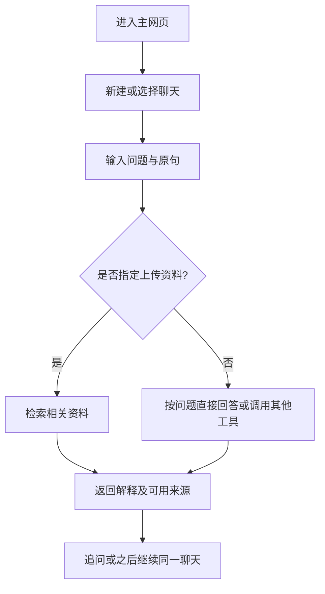
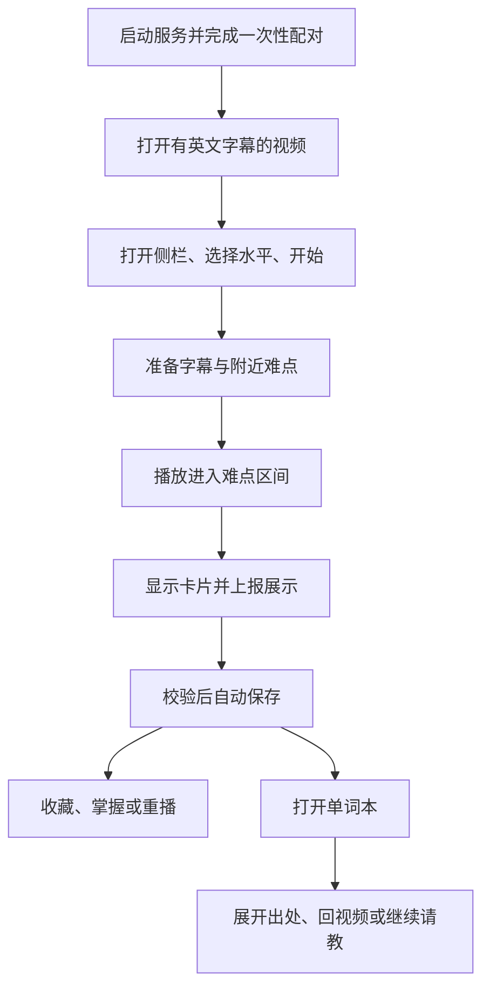
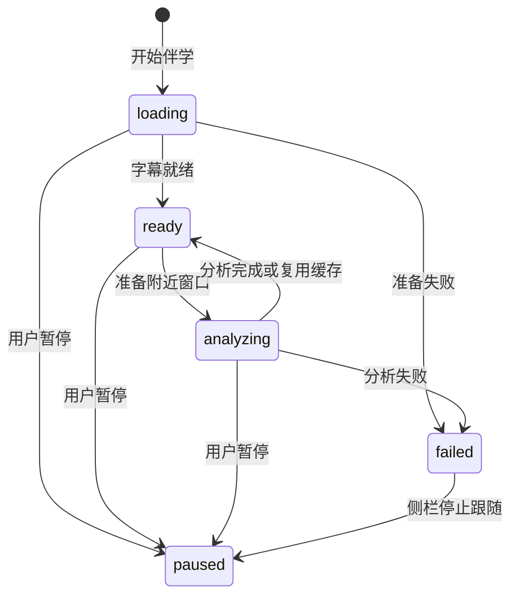

# 语境 · English Usage Coach 产品需求文档

| 项目 | 内容 |
| --- | --- |
| 文档版本 | 1.2 |
| 产品基线 | 产品第二版 v2；程序 v0.2.0 |
| 更新日期 | 2026-10-10 |
| 文档范围 | 学习对话、资料学习、YouTube 视频伴学、单词本及必要设置 |
| 产品形态 | 本地主网页 + REST 后端 + Chrome 原生侧栏 |
| 使用范围 | 本机单用户、单进程 |

[项目首页](../README.md) · [项目案例](product-case-study.md) · [真实演示](demo.md) · [接口说明](api.md) · [交互设计稿](prototype/README.md)

本文描述当前版本的功能规则、状态、异常和验收条件，并在第 12 节列出下一轮改进。文中的“已实现”表示已有对应代码；执行结果按程序测试、真实使用与设计检查分类，见第 10 节及验证记录。

## 1. 背景、用户与目标

### 1.1 背景

中文母语学习者在阅读和观看英文内容时，可能认识单个词，却不理解整个搭配或短语在原句中的含义。获得中文翻译后，也可能仍不清楚语气、搭配和使用场景。

产品提供语境解释与可追问的学习入口，并针对视频观看的注意力限制，使用简短卡片帮助用户理解潜在难点。单词本保留原句及出处，便于回顾和进一步提问。

### 1.2 目标用户与任务

| 用户行为 | 使用任务 | 对应模块 |
| --- | --- | --- |
| 主动阅读英文文章、报告或学习笔记 | 理解表达含义、语气和用法，继续追问 | 学习对话 |
| 依据自己的教材或笔记学习 | 从指定资料中找到相关内容，核对来源 | 学习资料与 RAG |
| 观看有英文字幕的 YouTube 视频 | 在对应位置快速理解潜在难点 | 视频伴学 |
| 希望回顾遇到的表达 | 查看原句、定位出处、标记重点和继续请教 | 单词本 |

### 1.3 产品目标

1. 使用户能围绕原句完成解释与连续追问。
2. 使用户能在视频旁看到少量与当前时间相关的难点提示。
3. 使实际展示的表达保留语境与出处，并连接后续学习。
4. 使等待、失败、暂停和恢复路径清晰可操作。

### 1.4 本版不包含

账号与多用户云服务、移动端、直播、Shorts、无字幕语音识别、画面理解、自动读取任意网页、图片聊天、发音评分、间隔复习计划、完整记录删除与分页管理、浏览器商店发布。

## 2. 范围与优先级

P0 为核心任务必要能力；P1 为提高任务完成度与恢复能力的功能。依据是核心闭环、中断风险及实现成本，不使用未采集的行为频率。下表对应当前版本，后续改进单列。

| 编号 | 功能 | 优先级 | 当前范围 |
| --- | --- | --- | --- |
| C01、C02、C04 | 输入、语境回答、连续追问与历史 | P0 | 已实现 |
| C03 | 按需工具检索与来源 | P0 | 已实现，内容质量需持续评估 |
| C05 | 单词本连接对话 | P1 | 已实现 |
| D01—D03 | 资料导入、检索问答与失败反馈 | P0 | 已实现 |
| V01—V03 | 配对、开始伴学、准备字幕 | P0 | 已实现 |
| V04—V06 | 难点分析、时间触发、会话停止 | P0 | 已实现 |
| V07—V08 | 卡片操作、后备字幕导入 | P1 | 已实现 |
| B01—B02 | 展示后保存与语境记录 | P0 | 已实现 |
| B03—B05 | 筛选、收藏掌握、出处与追问 | P1 | 已实现，有已知细节限制 |

### 2.1 优先级判断与方案约束

| 判断 | 选择 | 理由 |
| --- | --- | --- |
| 主动学习和观看是否共享同一界面 | 分设两个入口 | 对话需要长解释与追问，视频需要短暂扫读 |
| 是否为每行字幕生成翻译 | 不作为当前展示方式 | 优先降低信息负担，完整原句按需展开 |
| 是否对所有分析结果保存 | 只记录实际展示 | 缓存表示准备完成，不表示用户遇到 |
| 是否由模型控制时间与保存 | 程序决定 | 保证时间、去重、暂停及数据关系可验收 |
| 是否先增加图片与无字幕识别 | 后续扩展 | 先稳定文本与字幕任务，避免扩大输入和评估范围 |

## 3. 信息架构与入口

### 3.1 主网页

| 区域 | 内容与主要操作 |
| --- | --- |
| 学习对话 | 新建与切换聊天、输入问题、流式回答、来源、历史 |
| 我的单词本 | 表达列表、搜索、视频/状态/收藏筛选、原句与出处、继续请教 |
| 学习资料 | 上传文件、查看已入库资料、返回对话提问 |
| 视频伴学 | 安装配对说明、查看连接码、导入英文字幕 |

### 3.2 浏览器侧栏

侧栏从扩展图标打开，包含连接设置、英语水平、开始/暂停、当前视频标题、字幕来源、处理状态、当前难点卡片和主网页单词本入口。

侧栏不放入完整聊天工作区。普通句子不逐句显示解释；原句和翻译按需展开。

### 3.3 视觉与内容层级

主网页与侧栏采用浅蓝主色、扁平化布局和圆角卡片。视频卡片优先级为：表达 → 当前含义 → 简短说明 → 折叠的原句与翻译 → 操作与保存状态。

设计稿见 [原型说明](prototype/README.md)。当前页面统一使用“实际展示后自动记录，收藏标记重点”；图片提问和保存失败直接重试单列设计探索，不计入当前能力。原生 Figma 已完成 35 个当前状态与 2 个独立探索画板，建立主要交互连接并导出页面；布局与连接检查见 [交付记录](prototype/delivery-status.md)。设计入口：[原生文件](https://www.figma.com/design/SSKWRf7RIyYh62SzvAtjHX)、[对话原型](https://www.figma.com/proto/SSKWRf7RIyYh62SzvAtjHX?node-id=4-35&starting-point-node-id=4%3A35&scaling=scale-down&content-scaling=fixed)、[视频伴学原型](https://www.figma.com/proto/SSKWRf7RIyYh62SzvAtjHX?node-id=4-54&starting-point-node-id=4%3A54&scaling=scale-down&content-scaling=fixed)；原生导出为 37 个 SVG 和 6 个 PNG，245 个点击连接及 2 个自动过渡。

## 4. 主要用户流程

### 4.1 对话与资料



资料须先完成导入，再通过问题明确引用相关文件。流程表达产品任务，实际工具选择由聊天 Agent 按规则执行。

### 4.2 视频与记录



## 5. 学习对话需求

### C01 问题输入与提交

**用户目标：**把具体表达、原句或学习问题交给助手。

| 项目 | 规则 |
| --- | --- |
| 输入 | 文字，最多 6000 字符；提交前去除两端空白 |
| 提交 | 点击发送或 Enter；Shift+Enter 换行，中文输入法组词时不误提交 |
| 空输入 | 不发出聊天请求 |
| 生成期间 | 禁止重复发送与新建聊天，避免同轮重复请求 |
| 输出 | 问题气泡、回答区域与处理状态 |
| 异常 | 网络错误显示说明；前端提交异常保留问题供重试 |

**验收：**空白输入不发请求；合法问题只产生一轮；超过上限不能作为合法请求进入模型；生成期间重复点击不会追加同轮请求。

### C02 语境解释

默认中文讲解、英文例句。按问题需要说明表达含义、自然英文解释、场景、语气、搭配、相近说法和误用，不机械输出全部栏目。新写例句标为自拟例句。

**验收：**使用语境明确、有多义性和缺少上下文的样例检查释义；不确定时说明歧义；不得将模型猜测的地域、流行度或用户能力写成事实。回答质量由内容评测判定，提示词存在本身不作为通过证据。

### C03 工具选择与来源

| 问题类型 | 预期行为 |
| --- | --- |
| 稳定的基础含义、改写或例句 | 可直接回答，不强制调用工具 |
| 指定笔记、教材或已上传文件 | 先调用 `search_materials`；指定文件时按文件名过滤 |
| 近期用法、是否仍流行、新 slang | 按提示规则调用 `web_search` 核实，失败时明确未核实 |
| 自己记录的表达或看过的视频 | 调用 `search_vocabulary`，需要上下文时调用 `get_video_context` |

资料回答区分原资料与补充解释；资料未包含答案时，不用常识冒充原文。来源使用工具返回的文件、页码和真实链接，不编造出处。

**验收：**覆盖检索命中、无相关结果、搜索失败和没有个人记录的样例；可用来源能核对；严格按资料回答时不补造答案。

### C04 连续追问、历史与流式状态

同一聊天保留上下文，支持“再举个例子”“这个说法正式吗”等追问。SQLite 保存展示历史与 Agent 状态，刷新或重启后可以继续选择原聊天。

| 状态 | 用户看到的内容 | 规则 |
| --- | --- | --- |
| 初始 | 示例问题和输入区 | 不自动发送问题 |
| 生成中 | 处理/工具状态与逐步更新的回答 | 流中的文本为完整快照，替换显示，不重复拼接 |
| 完成 | 最终回答与来源 | 完成回合保存为成功历史 |
| 失败 | 本轮未完成及错误说明 | 不把失败内容回放成成功回答 |
| 页面断开 | 再次打开后可查看历史状态 | 不自动重发同一问题；在途请求可完成并保存 |

**验收：**完成首轮后追问能承接表达；不同聊天上下文隔离；重启后历史可读；失败回合有状态；流式回答不重复累积。

### C05 单词本连接

从单词本点击“继续请教”，切换到聊天并预填“结合单词本里的语境，再解释一下……”的问题，包含表达与中文含义。用户确认后才发送。

**验收：**点击不直接调用模型；预填内容与所选条目一致；发送后可通过工具取得已有出处，不假称存在未保存的观看记录。

## 6. 学习资料需求

### D01 导入资料

| 项目 | 规则 |
| --- | --- |
| 格式 | UTF-8 TXT、Markdown、PDF、DOCX |
| 文件大小 | 默认不超过 20 MiB，可通过配置调整 |
| 解析 | TXT/MD 本地读取；PDF/DOCX 通过 MinerU 解析 |
| 重复 | 按内容哈希识别，重复内容不重复建索引 |
| 成功结果 | 文档目录与检索索引就绪，提示可以在聊天中按资料提问 |
| 不支持内容 | 图片附件不是本版资料导入格式 |

**验收：**合法示例能导入；空文件、超限、不支持格式、非 UTF-8 文本、无可检索内容有错误；重复导入不重复建立同一内容索引。

### D02 检索与引用

解析结果保留文件名及可用的 PDF 页码；分块后生成 Embedding，持久化至 Chroma。检索默认 Top-K 为 5，可配置；检索到的片段是候选依据，模型仍需判断与问题的关系。

模型、维度或分块配置变化时不静默混用旧索引，应提示恢复配置或使用新数据目录重新导入。

**验收：**按指定文件提问不混入其他文件作为该资料依据；存在页码时来源可核对；不相关片段不能直接冒充答案；索引配置不一致时有明确提示。

### D03 导入状态与恢复

导入时禁用重复点击，显示“正在解析并导入”；完成后更新目录；失败显示原因并恢复按钮。聊天或资料导入繁忙时拒绝并发操作，避免重复修改状态。

**验收：**成功与失败均能恢复操作；MinerU/Embedding 失败不显示导入完成；错误信息不泄露密钥。

## 7. 视频伴学需求

### V01 安装与配对

用户启动本地后端，在 Chrome 加载扩展，从主网页复制连接码，在侧栏填写本地服务地址并连接。扩展保存连接信息，后续使用复用；连接码与模型 API Key 分离。

**验收：**合法配置可连接；无效连接码或地址出现错误；YouTube 页面脚本不取得模型密钥和连接码；安装或更新后可按说明刷新页面。

### V02 开始、水平与视频绑定

用户在普通 YouTube 视频页手动开启侧栏，选择初级/中级/高级并点击开始。未点击开始不创建伴学任务。

会话绑定当前视频 ID、活动标签页、英语水平和字幕版本。运行期间水平选择锁定；重新开始可选择其他水平。视频位置范围为 0—14400 秒。

**验收：**开始后显示当前视频与准备状态；无普通视频时不创建有效会话；切换视频或活动标签页后停止旧跟随；旧响应不能覆盖新会话。

### V03 字幕准备

优先取得人工英文字幕，其次自动英文字幕；字幕全文保存至 SQLite，合并相邻滚动碎片并保留原时间轴。当前版本由模型生成中文说明，不额外抓取 YouTube 中文自动翻译。

**验收：**字幕来源可见；人工/自动轨道选择与失败后备逻辑正确；片段仍有可核对的原文和时间。平台或网络失败时，不承诺任意视频都能自动获取。

### V04 难点分析

| 项目 | 规则 |
| --- | --- |
| 处理窗口 | 当前分钟与下一分钟，附带附近字幕作为上下文 |
| 候选标准 | 影响理解、对所选水平可能有价值的难词、搭配、短语动词、习语或俚语 |
| 数量 | 每分钟最终最多 3 个；允许零个 |
| 表达 | 必须出现在指定原句中，不改写为不存在的词典原形 |
| 输出 | 片段编号、表达、语境含义、短解释、原句译文 |
| 时间 | 根据字幕片段编号查回，不接受模型另造时间 |
| 低质量输入 | 不对明显残缺或不确定的自动字幕强行解释 |
| 复用 | 视频、字幕版本、水平、模型和分析版本兼容时复用缓存，包括空结果 |

**验收：**超量候选被限制；无难点返回空列表；非法编号和不在原句中的表达被丢弃；解释正确性与难度适配另行人工复核。

### V05 播放触发与卡片展示

只有正常播放推进，且当前时间进入候选区间 `start ≤ t < end` 时，才新展示卡片。暂停、拖动、倒退、广告和页面隐藏不作为正常推进；倍速按播放速率判断。单轮同一英文表达不重复提示。

卡片已展示后可以保留，等待后续卡片替换，给用户阅读时间；字幕区间结束不表示必须立即移除已显示卡片。

**验收：**区间前后不新触发该卡片；跳过片段不批量入本；暂停或广告期间不因时间变化误触发；倍速与重复表达使用确定样例验证。

### V06 会话暂停、切换与重启

点击暂停、切换视频或活动标签页、关闭侧栏时，停止后续跟随请求。已发出的外部请求可以完成缓存，但不能重新激活已暂停会话，也不能将未展示内容入本。

服务重启后旧会话标为暂停，用户重新开始；新会话可以复用兼容的字幕与分析缓存。关闭主网页不会停止仍在运行的后端。

**验收：**旧请求返回后会话仍暂停；新旧视频不会串用卡片；重启后不假装仍正常跟随；已经保存的记录保留。

### V07 卡片内容与操作

| 元素 | 展示或操作 |
| --- | --- |
| 时间 | 表明表达来自哪个片段 |
| 表达 | 使用字幕中的原表达 |
| 含义 | 当前语境下的简短中文解释 |
| 短说明 | 解释搭配或语境，不展开完整课程 |
| 原句与翻译 | 默认折叠，点击展开 |
| 重播这句 | 定位到对应字幕起点 |
| 收藏 | 保存成功后，标为重点 |
| 已掌握 | 保存成功后，设置用户自报状态 |
| 保存状态 | 区分保存中、成功和失败 |

**验收：**原句、表达与时间一致；重播指向当前绑定视频；保存未成功时不能通过卡片操作一个不存在的条目。

### V08 英文字幕后备导入

主网页接收视频链接或 11 位视频 ID、可选标题、UTF-8 SRT/VTT。前端文件限制为不超过 2,000,000 字节；后端文本上限为 2,000,000 字符。导入后提示在扩展重新开始，字幕须对应原视频时间轴。

**验收：**合法字幕生成片段；无效 ID、过大文件、格式错误或空字幕有反馈；替换字幕后使用新版本，不混用旧分析结果。

## 8. 单词本需求

### B01 自动保存规则

本版采用“实际展示后自动记录，收藏标记重点”。提前分析只生成缓存，不直接形成学习记录。

侧栏在实际播放位置展示后上报，后端再次校验会话、视频、字幕版本、水平和时间范围。后端允许范围为片段开始前 1 秒至结束后 2 秒，用于展示上报的容差；前端新展示仍按真实字幕区间判断。

**验收：**不属于会话的卡片、错误时间、暂停会话上报均不形成合法保存；重复上报不重复插入同一记录。

### B02 条目与出处

以规范化的英文表达＋中文含义识别条目，保存短解释；每次有效出处保留视频 ID/标题、原句、译文、片段时间和遇到时间。同条目可以有多个出处。

这是文本级去重，不是模型完成的语义级同义合并。不同措辞的中文含义可能形成不同条目。

**验收：**相同表达与含义复用条目；不同出处仍可查看；重启后条目与关联关系保留。

### B03 查询与筛选

支持表达/中文含义搜索、视频筛选、全部/待学习/已掌握筛选以及仅收藏。按创建时间倒序，当前一次最多返回 200 个条目，没有完整分页。

**验收：**组合筛选结果符合条件；无结果时不显示旧条目；重新进入或页面获得焦点时可刷新数据。

### B04 收藏与掌握

收藏和掌握是独立标记；单词本可以取消收藏或选择重新学习。掌握为用户主动反馈，不依据一次展示自动置为已掌握。

当前后续取卡会过滤已掌握的英文表达，作用范围为表达整体；已到侧栏的候选列表和不同义项的即时精细过滤见第 12 节。

**验收：**修改持久化，刷新后仍一致；重新取卡时已掌握表达被过滤；重新学习恢复状态，不删除原出处。

### B05 出处与继续请教

展开条目可查看原句、译文、视频标题与时间链接；打开出处定位视频片段。“继续请教”预填表达与语境含义，发送由用户确认。

**验收：**字段来自实际记录；链接包含正确视频与时间；无来源时不编造；不因继续请教而自动发出模型请求。

## 9. 状态、异常与恢复

### 9.1 后端会话状态



重新开始创建新会话，而不是把旧失败状态直接视为恢复成功。

### 9.2 当前异常行为与下一步

| 异常/状态 | 当前版本行为 | 用户可以做什么 |
| --- | --- | --- |
| 本地服务未运行或连接请求失败 | 侧栏显示连接错误，停止跟随 | 启动服务、检查地址和连接码后重试 |
| 无可用英文字幕/获取失败 | 会话失败，展示说明 | 重试获取或导入对应 SRT/VTT |
| 模型超时、配置或返回格式错误 | 会话失败，停止跟随 | 查看错误、处理配置或服务问题后重新开始 |
| 普通句子没有候选 | 返回并缓存空列表，不强行生成卡片 | 继续观看 |
| 分析来晚 | 已越过区间不再新触发该卡片 | 回放原区间；新会话可复用已完成缓存 |
| 保存失败 | 卡片显示失败，收藏/掌握不启用，取消该表达的本轮已见去重 | 回放或重新开始后再次展示并上报 |
| 状态修改失败 | 显示失败，不把按钮改成成功状态 | 再次操作或检查服务 |
| 原视频无法访问 | 保留本地原句与出处记录 | 查看已有内容，或携带语境继续提问 |

当前统一错误提示仍较粗，暂停后部分旧卡片的可见状态也需进一步统一。更细的提示及恢复按钮属于下一轮交互改进。

### 9.3 等待与超时

| 环节 | 当前配置/行为 | 含义 |
| --- | --- | --- |
| 扩展访问本地接口 | 单请求 15 秒超时 | 不代表整个字幕任务只能运行 15 秒 |
| 字幕抓取 | HTTP 请求默认 25 秒 | 网络及平台仍可导致失败 |
| 模型调用 | 默认超时配置 90 秒，SDK 最多 1 次重试 | 不把该值当作端到端完成时限 |
| MinerU | 默认 300 秒超时 | 资料解析可能比普通聊天更慢 |
| 侧栏取结果 | 约每 2 秒请求一次，浏览器本地判断播放 | 不使用 WebSocket |

等待时不自动暂停用户视频，不承诺尚未实测的响应时延或服务 SLA。

## 10. 验收与已有结果

### 10.1 核心验收清单

| 编号 | 验收任务 | 通过条件 |
| --- | --- | --- |
| AC01 | 输入表达并追问 | 回答与原句相关，同一聊天可承接上下文 |
| AC02 | 刷新或重启后打开聊天 | 历史存在，失败回合状态正确，不串聊天 |
| AC03 | 导入示例笔记并按文件提问 | 导入成功，来源可核对，无答案时明确说明 |
| AC04 | 安装并配对后开始视频伴学 | 当前视频、水平、字幕来源和状态可见 |
| AC05 | 正常播放及倍速经过难点 | 只在对应区间新触发，单轮表达去重 |
| AC06 | 暂停、拖动、广告、隐藏与切换视频 | 不误判正常推进，不把旧卡片套到新视频 |
| AC07 | 展示后打开单词本 | 有表达、语境含义、原句与正确视频时间 |
| AC08 | 重复上报和跳过片段 | 无重复记录；未展示的缓存不批量入本 |
| AC09 | 收藏、掌握、重新学习与筛选 | 状态持久化，组合筛选一致，后续取卡过滤生效 |
| AC10 | 保存失败、字幕失败及模型失败 | 显示真实失败，不显示成功，可找到恢复路径 |
| AC11 | 暂停时后台任务完成，或服务重启 | 不重新激活已暂停会话，记录仍保留 |
| AC12 | 单词本继续请教 | 预填而不直接发送，确认后能结合记录解释 |

验收执行状态见 [需求—验收—证据矩阵](verification.md#3-需求验收证据对应)。每项同时关联测试函数、真实截图或代码与原型检查；只具备部分证据的条目明确标为部分覆盖。

### 10.2 需求追踪

| 需求 | 验收关联 | 验证材料 |
| --- | --- | --- |
| C01、C02 | AC01 | TC01–TC03；P01/P02；R01；E01/E02/E09 |
| C03 | AC01、AC03、AC10 | TC04–TC05；P03/P04；R02/R03；E03/E04/E10 |
| C04 | AC02 | TC06–TC07；P01/P02/P05；R04 |
| C05 | AC12 | TC22；K01；U01 |
| D01、D03 | AC03、AC10 | TC08–TC10；P06/P07；R03；U01 |
| D02 | AC03 | TC09；P06/P07；R03；E03/E10 |
| V01、V02 | AC04、AC06 | TC11–TC12；P05/P08；K02；R05 |
| V03、V08 | AC04、AC10 | TC13–TC14；P08/P09；R05/R07 |
| V04 | AC05 | TC15；P10；E05–E08/E11/E12 |
| V05、V07 | AC05、AC06、AC07、AC10 | TC16–TC18；P11；K02；R05；U01 |
| V06 | AC06、AC11 | TC19；P12/P13；K02 |
| B01、B02 | AC07、AC08、AC11 | TC17–TC20；P08/P13/P14；R05/R06 |
| B03、B04 | AC09 | TC21；P14；K01；R06 |
| B05 | AC07、AC12 | TC22；P08；K01；R06；U01 |

P 为程序测试，R 为真实记录，K 为代码检查，U 为本地设计检查；具体函数与证据链接见验证文档，E 为模拟内容评估样例。

### 10.3 执行结果

| 日期 | 证据 | 覆盖范围 |
| --- | --- | --- |
| 2026-10-10 | 35 项 Python 测试通过 | 聊天、持久化、资料协议、REST、字幕、分析缓存及记录业务 |
| 2026-10-10 | 2 项 Node 测试通过 | 扩展播放推进、触发区间和表达去重的纯逻辑 |
| 2026-10-10 | Ruff 检查与格式检查通过 | 工程静态检查 |
| 2026-10-07 | 公共视频人工字幕实际获取 | 字幕抓取外部路径 |
| 2026-10-07 | DW News 实际侧栏截图和 4 条真实表达记录 | 卡片展示、保存反馈、单词本及一个已收藏状态 |
| 2026-10-09 | 原生 Figma 与设计材料交付 | 35 个当前状态、2 个独立探索；已检查原生布局、主要交互与页面导出，不作为真实服务质量数据 |

自动化中的模型及外部服务使用模拟响应；真实截图证明对应使用结果，不能扩展为所有平台状态均已人工验收。未将语言效果评测、外部用户调研或性能目标写成完成结果。原始范围见 [verification.md](verification.md)，截图见 [demo.md](demo.md)。

## 11. 数据与评估要求

### 11.1 数据对象

| 对象 | 主要字段与用途 |
| --- | --- |
| 聊天/回合 | 问题、回答、来源、状态、错误与时间；支持历史 |
| 文档 | 文件名、内容标识、解析与检索元数据；支持资料问答 |
| 视频 | 视频 ID、标题、字幕片段、来源与版本 |
| 伴学会话 | 视频、水平、当前位置、字幕版本、状态与错误 |
| 分析窗口/难点 | 缓存标识、分钟、片段编号、时间、表达、含义与译文 |
| 单词本 | 表达、语境含义、说明、收藏与掌握状态 |
| 出处 | 条目、难点、视频、原句、译文、时间与遇到时间 |

### 11.2 当前可用统计示例

以下 SQL 用于统计各视频关联的去重表达及当前标记，尚未作为用户增长或学习效果报告：

```sql
SELECT
    o.video_id,
    MAX(o.title) AS video_title,
    COUNT(DISTINCT o.vocabulary_id) AS recorded_expressions,
    COUNT(DISTINCT CASE WHEN v.favorite = 1 THEN v.id END) AS favorites_now,
    COUNT(DISTINCT CASE WHEN v.mastered = 1 THEN v.id END) AS mastered_now
FROM occurrences AS o
JOIN vocabulary AS v ON v.id = o.vocabulary_id
GROUP BY o.video_id
ORDER BY recorded_expressions DESC;
```

同一条目可有多个视频出处，各视频数量相加不等于全局条目数。收藏和掌握是当前状态，不能从中直接推导每日新增行为或客观掌握率。

### 11.3 后续评估计划

优先评估首次使用成功、提示及时性、解释正确性、提示价值、漏判和回顾路径。计划使用 3—5 位学习者的任务观察及约 20—30 条内容探索集，记录样本、错误和复核依据。

内容评估使用语境准确、依据一致、水平与任务适配、信息负担、学习价值五维评分，核心事实错误直接否决。12 个完整模拟样例、指标口径和提示及时性计算见 [AI 评估](ai-evaluation.md)。这些材料定义方法，真实输出另行执行和复核。

如增加事件，最小集合包括开始、准备完成、失败、卡片展示、重播、收藏、掌握变更、打开出处和继续请教；保存成功与失败分别记录。事件字段至少包含匿名会话、视频、片段、发生时间、结果及错误类别，不记录密钥或完整资料。当前仅有结构化记录及服务请求日志，尚没有该完整事件集合。

## 12. 下一轮改进与优先级

| 顺序 | 需求 | 改进目标 | 验收条件 |
| --- | --- | --- | --- |
| P1 | 掌握状态即时过滤 | 用户标记后，已进入侧栏的候选也及时更新 | 标记后不再提示该表达；重新学习后恢复，义项拆分另列 |
| P1 | 义项级掌握 | 避免掌握一个含义就屏蔽该表达的所有含义 | 同表达不同语境义项可分别控制 |
| P1 | 错误分类与恢复 | 区分配置、网络、字幕、模型和保存问题 | 对应提示与操作一致，不把所有错误写成未启动服务 |
| P1 | 保存直接重试 | 已看见的卡片保存失败后可就地重试 | 不依赖回放，不重复入本 |
| P1 | 空结果与等待区分 | 区分尚在分析、没有难点和失败 | 用户能根据状态判断是否继续等待 |
| P2 | 图片提问 | 支持截图学习入口 | 格式/大小、清晰度、接口、模型消息和历史路径完整 |
| P2 | 记录管理 | 支持更大记录量与主动整理 | 分页、删除或导出具有明确规则与回归检查 |
| 后续 | 无字幕、多平台或复习系统 | 根据任务验证再扩展 | 先定义新场景，再决定工具与架构 |

本版统一为“实际展示后自动记录，收藏标记重点”；设计稿不提供保存模式切换。

## 13. 非功能要求与技术约束

### 可控性与安全

模型密钥只在后端；网页采用同源认证，扩展用本地连接码。HTTP 有请求编号、错误脱敏和主机限制。外部内容作为资料，不执行其中指令。

聊天每轮模型调用上限为 6、工具调用上限为 8；视频使用固定流程、限并发、分段缓存和结构校验。并发繁忙时有明确响应，不承诺本机版本具备多用户服务能力。

### 数据关系与生命周期

一个聊天包含多个回合；一次资料导入包含多个向量片段。一个视频拥有字幕版本，一个伴学会话绑定视频、字幕版本与水平；一个分析窗口产出零至多个难点。一条单词本表达可以关联多个出处，展示上报对同一难点去重。收藏/掌握修改状态，不删出处。

| 场景 | 数据规则 |
| --- | --- |
| 重复导入资料 | 内容哈希相同则复用；不会再次生成同一索引 |
| 部分入库失败 | 回滚本次向量及目录写入，允许重新导入 |
| 更换索引配置 | 阻止旧索引混用；恢复原配置或使用新目录 |
| 替换字幕 | 更新字幕版本；新会话使用新版本，不复用旧难点 |
| 服务重启 | 记录保留，旧视频会话暂停，不自动恢复播放跟随 |
| 关闭网页 | 不清空数据库，后端生命周期由终端控制 |
| 记录清理/账号注销 | 当前无完整界面流程；单独列为后续数据管理设计 |

### 数据与外部依赖

SQLite 保存结构化数据，Chroma 保存资料索引。首次升级备份旧 SQLite 并增量建表，保留历史与原有索引配置。上传资料、模型推理、Embedding 或联网检索可能调用外部服务。

字幕依赖平台接口、网络与可用轨道；解释依赖模型质量与原字幕。错误自动字幕不能仅靠生成模型保证修正。原视频或网络来源也可能失效。

### 性能与运行条件

本版采用单进程本地服务；字幕后台最多两个工作线程，同时登记任务有上限，忙碌时给出反馈，不排无限队列。复用空结果及兼容缓存，减少重复调用；限制上传大小、问题长度和工具预算。超时配置见 9.3，响应速度、成本和 SLA 不作为已实测结果。

### 界面与可读性

主要操作有明确文字、状态与禁用反馈；原句可展开核对；保存失败不能仅靠颜色区分。主网页使用响应式布局；浏览器侧栏按普通观看模式使用，不作为播放器全屏悬浮层。

## 14. 实现与文档索引

| 需求 | 依据 |
| --- | --- |
| 对话、状态与工具规则 | [runtime.py](../english_coach/runtime.py)、[prompts.py](../english_coach/prompts.py)、[tools.py](../english_coach/tools.py) |
| 资料与向量 | [knowledge.py](../english_coach/knowledge.py)、[embeddings.py](../english_coach/embeddings.py) |
| 字幕与分析 | [video.py](../english_coach/video.py) |
| 保存、去重、筛选与掌握 | [learning.py](../english_coach/learning.py) |
| REST、认证与输入校验 | [server.py](../backend/server.py)、[API 文档](api.md) |
| 播放判断与卡片 | [core.js](../extension/core.js)、[sidepanel.js](../extension/sidepanel.js) |
| 主网页与预填追问 | [app.js](../frontend/app.js)、[index.html](../frontend/index.html) |
| 验证 | [测试目录](../tests/)、[验证记录](verification.md)、[真实演示](demo.md) |
