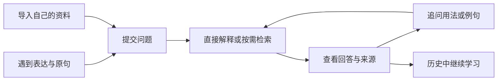
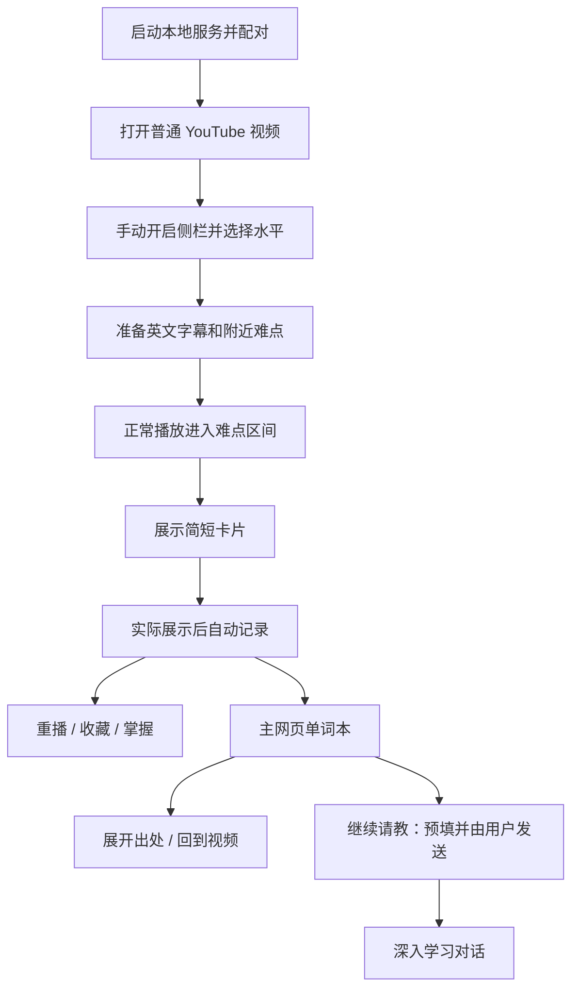
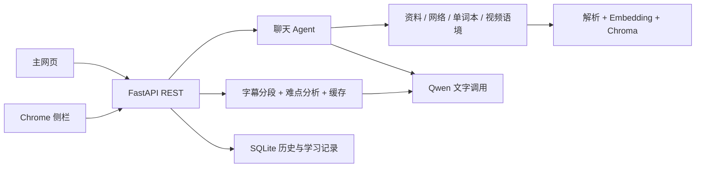

# 语境 · English Usage Coach

> AI 产品案例 · 产品第二版 v2 · 程序 v0.2.0 · 文档版 1.2 · 2026-10-10

**在真实英文内容中理解表达，把一次查词延续为有语境的学习。**

[项目首页](../README.md) · [工程案例](engineering-case-study.md) · [案例 PDF](../output/pdf/english-usage-coach-case-study.pdf) · [完整 PRD](prd.md) · [界面与交互](prototype/README.md) · [实际演示](demo.md) · [验证与验收](verification.md) · [AI 评估](ai-evaluation.md)

## 项目概览

语境面向有主动学习意愿、接触真实英文内容的中文母语英语学习者。它围绕搭配、短语、习语及专有表达在具体语境中的含义，提供两个学习入口：阅读时主动提问的学习对话，以及观看 YouTube 时按播放位置出现的简短难点提示。单词本保存遇到的表达、原句和出处，连接观看与后续深入学习。

| 维度 | 内容 |
| --- | --- |
| 产品形态 | 本地主网页 + FastAPI REST 后端 + Chrome 原生侧栏 |
| 本人负责 | 需求定义、产品方案、核心业务逻辑设计与落地、接口和数据组织方案、实际试用及迭代 |
| AI 协作 | 前端代码辅助生成；协助代码检查、测试和验收。核心业务逻辑与产品规则由本人提出并推进实现 |
| 版本演进 | v1 建立对话、资料 RAG 与历史；v2 迁移至网页前后端并增加视频伴学与单词本 |
| 交付成果 | 可运行系统、21 项需求、12 项核心验收、35 个原生 Figma 当前状态及 2 个独立探索画板、真实功能截图、AI 评估规则与案例 PDF |
| 使用边界 | 本机单用户、单进程；视频入口支持有可用英文字幕的 YouTube 普通视频 |

## 1. 问题发现：理解译文与学会表达是两件任务

项目从个人英语学习中的具体阻力出发：阅读英文文章、报告和笔记时，常常认识单个词，却不理解词组整体的意思；看视频时，暂停、复制字幕、切换查询工具会打断内容理解。翻译帮助获得大意，但学习者还需要知道原表达为什么这样用、语气是什么、能否换一种说法。

以 `draw on experience` 为例，逐词翻译容易偏离“利用经验”的语境义项。即使译文正确，用户仍可能想进一步问：它与 `use experience` 有什么区别？适合哪些场景？能否给出自己的例句？

因此，产品机会不是增加一个通用翻译入口，而是组织一条连续任务：**理解当前语境 → 了解表达用法 → 保留出处 → 按需继续追问。** 视频入口还必须考虑用户只有短暂时间扫读提示。

### 问题依据与分析方法

本项目以个人学习需求、已有产品实现和实际试用记录为依据，使用任务拆解、替代方案比较及失败路径分析形成需求。以下行为画像与场景是产品设计场景，用于明确任务和验收边界；本阶段未开展外部用户访谈。

## 2. 用户与场景：按学习行为确定服务对象

优先用户已经在接触英文内容，愿意主动理解和学习表达。视频场景以能跟上部分内容、但会被搭配和专有表达卡住的学习者为重点；初级、中级、高级由用户自选，作为提示强度输入，不等同于能力测评。

| 设计场景 | 行为与触发 | 用户任务 | 成功状态 |
| --- | --- | --- | --- |
| 阅读者：英文报告中的搭配 | 读到 “We draw on previous research.”，理解词却不确定组合含义 | 提交原句，理解搭配并问一个工作场景例句 | 解释对应当前义项，追问承接同一表达 |
| 资料学习者：自己的教材或笔记 | 已上传学习资料，需要查指定章节或表达 | 依据指定文件提问，核对引用 | 找到相关片段，区分资料内容与补充解释 |
| 观看者：英文新闻或知识视频 | 正在连续观看，没时间逐句查词 | 在相关播放位置扫读少量提示 | 不需要离开视频，能迅速知道表达在这里的含义 |
| 回顾者：看完后继续学习 | 想找回刚才的表达及视频位置 | 按视频或收藏筛选，展开出处，再请教 | 能找到原句、定位视频，并把语境带入对话 |

上述任务排除了仅想快速获取全文中文译文、没有学习意愿的用户，也暂不覆盖完全无法借助英文字幕跟上内容的零基础观看场景。

## 3. 需求分析：从任务拆出优先级

| 用户阻力 | 需求 | 对应能力 | 优先级与理由 |
| --- | --- | --- | --- |
| 译文缺少用法解释 | 结合原句解释并可追问 | C01–C04 学习对话、来源与历史 | P0，主动学习的核心闭环 |
| 通用回答未必依据自己的资料 | 明确检索范围与出处 | D01–D03 资料导入、检索与反馈 | P0，资料问答需要可靠依据 |
| 查词打断观看，长回答来不及阅读 | 稀疏、简短、随时间出现的提示 | V01–V06 配对、字幕、筛选、触发与停止 | P0，视频入口的核心体验 |
| 事后忘记表达来自哪里 | 保存遇到的语境与出处 | B01–B02 展示后记录、条目与出处 | P0，连接学习过程 |
| 看过不代表已会或喜欢 | 独立标记重点和掌握 | B03–B05 筛选、状态与继续请教 | P1，帮助后续回顾 |
| 平台字幕可能获取失败 | 能恢复任务而不是停在报错 | V08 英文 SRT/VTT 后备导入 | P1，减少外部依赖带来的中断 |

完整功能定义见 [PRD](prd.md)。优先级依据是核心任务能否闭环以及中断成本，未以未经验证的使用频率排序。

## 4. 产品定位与范围

**定位：真实英文内容中的语境表达学习助手。** 对话解决主动选择的问题；视频解决短暂注意力下的理解阻力；单词本承接回顾。两个入口使用不同交互，但共享“表达—含义—语境—出处”的学习对象。

| 替代方式 | 适合的任务 | 本项目采取的设计 |
| --- | --- | --- |
| 网页或字幕翻译 | 迅速理解内容大意 | 补充搭配、语气、用法及可追问入口 |
| 词典与搜索 | 查词义和用例 | 用原句确定当前义项，并保留出处 |
| 通用 AI 对话 | 灵活提问与生成解释 | 组织学习导向回答、资料检索和记录工具 |
| 视频学习插件 | 在观看界面附近获得语言帮助 | 少量难点卡片、折叠原句、播放触发与学习记录 |

这是任务与交互方式的比较。视频交互参考 Relingo，Agent／RAG 的实现思路来自相关学习实践。

### 本版与后续范围

本版交付文字对话、TXT/MD/PDF/DOCX 资料学习、英文字幕伴学、历史与单词本。图片提问、视频画面理解、无字幕识别、自动读取任意网页、直播、Shorts、多用户云服务及完整复习系统均属于后续范围。

当前配置多模态模型，现有入口仍使用文字。模型的能力范围与产品已经交付的能力范围分别管理。

## 5. 用户流程与信息架构

### 主动学习与资料问答

### 视频理解与学习回顾

主网页组织为学习对话、我的单词本、学习资料、视频伴学四个区域。扩展侧栏只保留连接、水平、开始/暂停、状态和当前卡片。首次配对与日常开启分开，避免每次都重复配置。

## 6. 原型与交互：同一表达，两种阅读节奏

浅蓝色、白色卡片和扁平化组件保持界面简洁。主网页支持长回答和来源展开；侧栏优先显示表达、语境含义与短说明，将原句和翻译折叠。收藏与掌握是两个独立状态。

上图为原生 Figma 画板导出，使用示例内容。已完成 [原生 Figma 文件](https://www.figma.com/design/SSKWRf7RIyYh62SzvAtjHX) 的 35 个当前状态、2 个独立探索画板与主要交互连接；[原生交互原型](https://www.figma.com/proto/SSKWRf7RIyYh62SzvAtjHX?node-id=4-35&starting-point-node-id=4%3A35&scaling=scale-down&content-scaling=fixed) 和 [本地预览](prototype/index.html) 见 [设计说明](prototype/README.md)。布局、连接及原生导出记录见 [交付记录](prototype/delivery-status.md)。

### 关键设计判断

| 决策 | 选择理由 | 取舍与处理 |
| --- | --- | --- |
| 分设对话和视频入口 | 主动阅读可以深入，观看只有短暂扫读 | 用单词本、语境工具和继续请教连接两端 |
| 每分钟最多 3 个，也允许零个 | 限制额外阅读负担 | 接受漏判风险，以内容评测评价提示价值 |
| 解释当前语境而非词典全部义项 | 用户首先需要理解正在接触的内容 | 深入义项留给展开与对话 |
| 原句与翻译默认折叠 | 把表达和含义放在第一视觉层级 | 需要核对时展开，不删掉判断依据 |
| 实际展示后自动记录，收藏标记重点 | 减少观看过程中的摘抄操作 | 自动记录仅表示遇到，不代表喜欢或学会 |
| 只分析当前和下一分钟 | 控制调用范围并提前准备附近内容 | 首次开始或跳转可能来晚；回放可复用缓存 |
| Chrome 原生侧栏 | 帮助紧邻视频，无需另造播放器 | 有安装和配对成本，占用网页宽度 |

## 7. 功能需求与异常设计

对话允许主动选择表达并持续追问；指定资料时先检索，询问个人记录时查询单词本与附近字幕。资料导入按内容去重，成功后才进入可检索目录。聊天显示历史与 Agent 状态持久化，失败回合与成功回合分开保存。

视频按字幕原始时间触发提示，暂停、跳转、倒退、广告、页面隐藏及视频切换不作为正常播放推进。模型返回片段编号，程序查回原句与时间；未实际展示的分析缓存不进入单词本。

单词本以规范化表达及中文含义进行文本去重，保留多个出处。当前学习记录主要来自视频；学习对话可以检索记录，单词本可以预填问题回到对话，但没有“所有聊天回答自动入本”的功能。

| 异常 | 当前恢复路径 | 设计目标 |
| --- | --- | --- |
| 字幕不可用 | 重试，或在主网页导入对应英文 SRT/VTT 后重新开始 | 保留可执行的后备入口 |
| 首段分析未完成 | 准备状态，视频继续播放 | 不把等待当作没有难点 |
| 分析来晚 | 已过期区间不新弹出，回放时使用缓存 | 避免提示错配正在观看的内容 |
| 模型或服务失败 | 显示错误并停止跟随，处理后重新开始 | 不显示虚假的就绪状态 |
| 保存失败 | 显示失败，收藏/掌握禁用；回放或重开后再次展示 | 保存成功与卡片出现分开反馈 |
| 标记掌握后仍有缓存 | 后续取卡按表达过滤；已在侧栏缓存中的即时同步列入迭代 | 明确当前过滤粒度与时机 |

详细输入限制、状态和验收条件见 PRD C01–B05。

## 8. AI 方案：模型负责语言判断，程序负责业务约束

### 任务与工具选择

聊天意图开放，采用有限次数的 Agent 工具循环，按需调用资料、网络、单词本、视频语境四个工具。字幕任务的输入、输出和执行顺序明确，采用固定流程，便于管理时间、缓存与暂停。

RAG 负责资料的持续组织、检索和来源呈现；SQLite 负责结构化记录和历史；Chroma 负责资料向量。多模态模型保留扩展条件，不代替这些职责。

### 质量与可控性

难点分析限制候选数量，校验表达是否出现在对应原句，时间从字幕取回，缓存兼容条件包含字幕版本、水平和模型。聊天设模型调用上限 6、工具调用上限 8，避免无休止循环。密钥只留在后端，扩展连接码与模型密钥分离。

程序校验不能判定解释一定正确。因此另外定义语境准确、依据一致、难度适配、信息负担和学习价值五个维度，以及错义项、虚构来源、原句不一致等否决条件。具体样例及评分见 [AI 评估](ai-evaluation.md)。

## 9. 测试验收与真实成果

### 9.1 对话、资料与历史

2026-09-28 的真实 v1 记录包括日常英语问答、`based` 用法及网络来源、PDF 章节检索、上下文承接和历史入口。PDF 导入显示 85 个片段，资料问答返回文件与页码。v2 保留这些服务能力，改用网页前后端；旧截图作为功能验证历史，不作为当前界面截图。

旧回答中对网络俚语“仍然活跃”的表述与部分检索来源质量，提示后续需要提高时效断言和来源筛选标准；这项发现已纳入内容评测。全部原始演示见 [演示页](demo.md)。

### 9.2 视频卡片与单词本

在 **Germany's jobless youth | DW News** 的实际试用中，约 1:33 的 `remain disconnected from` 形成语境卡片，并显示自动保存反馈。

浅蓝主网页的真实单词本保留同一视频的 4 个表达：`remain disconnected from`、`puts them in touch with`、`unrecognized qualifications`、`NEETs`，其中第一项已收藏。

4 个表达表示这次视频的记录成果；收藏表示用户主动标重点。两者不直接作为学习效果或增长指标。

### 9.3 验证结构

| 层级 | 当前成果 | 证据入口 |
| --- | --- | --- |
| 业务与接口 | 35 项 Python 测试；覆盖历史、工具协议、资料、REST、字幕、缓存和保存 | [测试及需求对应](verification.md) |
| 扩展时间逻辑 | 2 项 Node 测试；覆盖正常/倍速、跳转、广告、隐藏、区间及去重 | [扩展测试](../tests/extension_core.test.cjs) |
| 工程静态检查 | Ruff 检查与格式检查通过 | [验证记录](verification.md) |
| 真实使用 | 对话、资料、历史、视频与单词本共 10 张功能截图 | [实际演示](demo.md) |
| 设计检查 | 35 个当前状态、2 个探索画板；245 个点击连接、2 个自动过渡；43 个原生导出 | [设计说明](prototype/README.md) |
| 内容评估设计 | 12 个有具体输入、示例回答和评分的模拟样例 | [AI 评估](ai-evaluation.md) |

**证据范围：**真实截图记录对应的实际使用结果；程序测试使用临时数据和模拟外部响应；AI 评估样例用于展示评估方法。完整浏览器连续行为、外部用户体验、学习效果与付费服务端到端质量需另行验证。原生 Figma 的布局、主要路径及 43 个原生导出已完成检查，见设计交付记录；原型示例不作为真实模型质量或用户效果证据。

## 10. 数据分析：区分功能记录与产品效果

先判断用户是否完成任务，再评价提示价值。自动保存量不等于喜爱度，掌握标记也不等于客观能力提升。

| 产品问题 | 指标口径 | 支持的决策 |
| --- | --- | --- |
| 首次使用能否开始 | 完成配对并成功开始的任务 / 尝试任务 | 优化安装与连接成本 |
| 卡片能否赶上内容 | 实际经过区间内及时展示的卡片 / 实际经过的目标候选 | 调整准备窗口与等待提示 |
| AI 选得是否有价值 | 被评价有帮助的提示 / 被评价提示；同时记录漏判 | 调整水平规则和筛选标准 |
| 解释是否可靠 | 通过内容规则的样例 / 被审查样例，并报告错误类型 | 改进提示词、来源和校验 |
| 记录能否承接学习 | 查看出处、重播与继续请教的任务完成情况 | 优化单词本到学习的连接 |

现有 SQLite 可以统计按视频的去重表达量、收藏及掌握当前状态，SQL 见 PRD。需要时序与曝光分母的指标属于后续埋点设计。AI 评估文档提供一个明确标为模拟的提示及时性计算示例，不把它当作线上指标。

## 11. 成果、迭代与复盘

本项目已形成两个可运行的学习入口和语境记录闭环，交付产品规则、界面状态、接口与数据组织、测试及真实演示。本人把“灵活对话”和“观看时少量提示”拆成不同任务，并在实施中将 AI 输出与程序约束结合，推进从 v1 到 v2 的产品形态调整。

| 迭代顺序 | 问题 | 下一版目标与判定 |
| --- | --- | --- |
| P1 | 已掌握表达仍可能留在侧栏缓存 | 标记后及时更新候选；重新学习恢复提示 |
| P1 | 掌握过滤按表达整体生效 | 按义项区分状态，避免一个含义屏蔽其他含义 |
| P1 | 保存失败恢复成本高 | 增加就地重试，并保持去重与真实反馈 |
| P1 | 等待、空结果与错误提示不够明确 | 可区分状态，提供与错误相符的恢复操作 |
| P2 | 后续记录量增加 | 分页、整理、导出及必要删除规则 |
| P2 | 截图学习需求 | 图片提问完整输入与历史路径；独立于当前文本能力 |

后续验证采用三个任务：根据笔记追问表达、观看字幕视频、回到单词本继续请教。任务观察重点是连接成本、提示是否打断、已会内容误提示、漏判与解释错误；这些结果将决定是否继续扩展图片和无字幕能力。

### 形成的产品判断

**任务决定信息密度。** 对话适合深入解释，视频卡片适合短暂扫读。将两者拆开后，能够围绕各自注意力条件设计状态与反馈。

**生成内容需要落到业务条件。** 解释由模型生成，时间、来源、数量、去重、保存与暂停由程序管理；分析完成与实际遇到必须分开。

**评价要匹配证据。** 记录闭环说明功能交付，语言样例说明内容判断，任务观察说明体验；三者结合才能支持后续产品决策。

[继续阅读完整 PRD](prd.md) · [查看需求—验收—证据](verification.md) · [打开交互设计](prototype/README.md)
