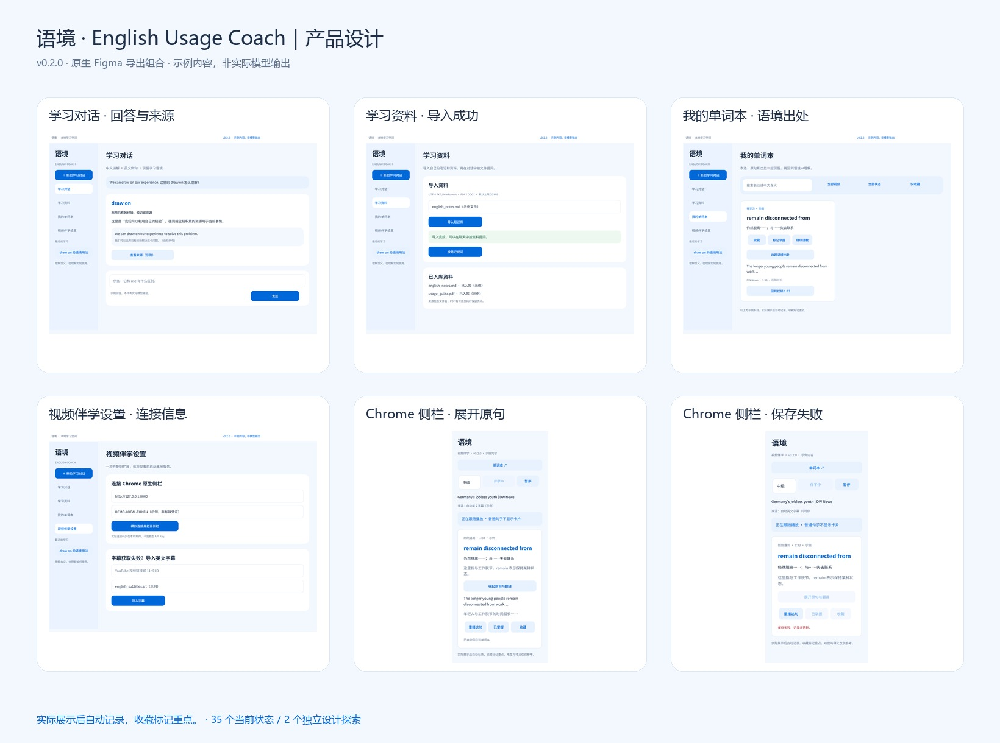

# 语境 · English Usage Coach｜界面与交互设计

> 产品 v0.2.0 · 设计交付版 1.2 · 2026-10-09

[项目案例](../product-case-study.md) · [PRD](../prd.md) · [原生 Figma 文件](https://www.figma.com/design/SSKWRf7RIyYh62SzvAtjHX) · [原生交互原型](https://www.figma.com/proto/SSKWRf7RIyYh62SzvAtjHX?node-id=4-35&starting-point-node-id=4%3A35&scaling=scale-down&content-scaling=fixed) · [本地预览](index.html) · [设计探索](exploration.html)

## 1. 设计交付与入口

| 材料 | 用途与来源 |
| --- | --- |
| 原生 Figma Design | 同一文件内的 3 个页面：规范与组件、当前版本、设计探索；当前版本 35 个可编辑状态画板 |
| 原生交互原型 | 245 个点击连接、2 个准备/保存自动过渡、9 个当前流程起点 |
| 本地 HTML | 使用同一原生文件导出的 SVG 和真实连线热点；双击 index.html 可离线查看 |
| SVG 与 PNG | 37 张状态 SVG、6 张主要页面 PNG，均从 Figma 原生导出；来源节点及校验值见 [导出来源](export-provenance.json) |
| 总览与 JPG | 根据原生导出组合的总览及预览，不作为真实模型输出或产品实测截图 |
| 真实运行图片 | [演示页](../demo.md) 保留已发生的实际使用记录，与设计示例区分 |

打开 [学习对话原型](https://www.figma.com/proto/SSKWRf7RIyYh62SzvAtjHX?node-id=4-35&starting-point-node-id=4%3A35&scaling=scale-down&content-scaling=fixed) 或 [侧栏伴学原型](https://www.figma.com/proto/SSKWRf7RIyYh62SzvAtjHX?node-id=4-54&starting-point-node-id=4%3A54&scaling=scale-down&content-scaling=fixed)。Figma 文件访问权限保持原设置；没有开放公开编辑。后续仓库展示发布见 [项目首页](../../README.md)。

## 2. 页面与状态范围

| 模块 | 当前版本设计状态 | 对应需求 |
| --- | --- | --- |
| 学习对话 | 初始、提问、回答、来源、历史；带视频语境的提问与回答 | C01–C05 |
| 学习资料 | 列表、导入中、成功、失败 | D01–D03 |
| 我的单词本 | 列表、筛选、语境出处、收藏、掌握 | B01–B05 |
| 视频伴学设置 | 配对说明、连接信息、字幕导入中/成功/失败 | V01、V08 |
| Chrome 原生侧栏 | 开始、准备中、难点卡片、展开原句、保存中、暂停；折叠/展开时的收藏与掌握反馈 | V02–V07 |
| 侧栏异常 | 字幕不可用、模型失败、分析来晚、保存失败 | V03、V05–V08 |

图片提问和保存失败直接重试各有独立原生探索画板，放在“03 · 设计探索”，不计入当前实现。本版不提供保存模式切换。

## 3. 核心交互规则

**实际展示后自动记录，收藏标记重点。** 分析缓存不直接入本；掌握由用户主动反馈，当前掌握过滤按表达整体生效。

侧栏先呈现少量难点、语境含义和简短解释，原句与翻译折叠。正常播放进入难点时间区间才新触发提示；来晚的结果不突然补到当前画面，回放可使用缓存。

收藏或掌握后留在侧栏显示按钮反馈；点击“单词本”才查看主页面。保存中和失败时禁用收藏/掌握，并禁用会误显示成功记录的展开操作；当前恢复方式是回放或重新开始。单词本支持展开出处、回到对应视频位置及继续请教。继续请教预填表达和含义，用户确认发送后才进入回答。

所有回答、释义、文件名、时间、连接信息和凭证均标为示例。Figma 和 HTML 的按钮进入预设状态，不调用模型、不上传资料、不播放视频，不持久化收藏或掌握；连续组合操作不能代表真实数据状态。未来功能的按钮禁用。

## 4. 主要预览路径

1. 学习对话：初始 → 示例提问 → 回答 → 来源 → 历史。
2. 学习资料：列表 → 导入中 → 成功 → 按资料提问；失败 → 重新导入。
3. 视频准备：配对说明 → 示例连接信息 → 侧栏开始 → 准备中 → 保存中 → 难点卡片。
4. 观看与保存：卡片 → 展开原句 → 收藏/掌握反馈 → 单词本。
5. 回顾与追问：单词本 → 语境出处 → 回到视频；继续请教 → 确认发送 → 示例回答 → 返回语境。
6. 失败恢复：模型失败 → 重新开始；字幕不可用 → 手动导入字幕；导入失败 → 重试；分析来晚/保存失败 → 回放；暂停 → 继续。

本地页面顶部的状态选择器可进入全部当前画板。“自动演示准备/保存”可关闭，方便停留检查过程态。浏览器缩放用于查看小字。原生 Figma 使用预设画板跳转模拟主页面与侧栏切换，不实际启动 Chrome 扩展或外部视频。GitHub 可显示静态图片，交互预览需要打开 HTML 或 Figma；未部署 GitHub Pages。

## 5. 视觉与组件

浅蓝色、扁平化、接近 iOS 的简洁视觉。主网页 1200 宽，侧栏 400 宽，较长状态允许内容高度增长。

| 规范 | 值 |
| --- | --- |
| 背景 / 卡片 | #F3F8FF / #FFFFFF |
| 主色 / 正文 | #0068D9 / #1C2D45 |
| 次级文字 / 边线 | #60738D / #DCE7F5 |
| 间距 | 4 / 8 / 12 / 16 / 24 / 32 |
| 常用圆角 | 12 / 20 |
| 文字层级 | 标题 30、模块标题 22、正文 15、标签 14、辅助 12 |
| 字体 | Noto Sans SC，Regular / Medium / Bold |
| 基础组件 | 按钮、输入框、导航、提示、难点卡片、单词本条目；6 组 / 19 变体 |
| 设计变量 | 2 个集合、44 个变量；5 个文字样式 |

页面使用可编辑文字、Frame、图形、组件实例和 Auto layout；文字按高度自适应，内容容器 Hug contents。重复区域可在“01 · 设计规范与组件”修改组件。“02 · 当前版本 v0.2.0”与未来探索分开。

## 6. 文件与本地查看方式

| 文件 | 用途 |
| --- | --- |
| [index.html](index.html) | 原生 SVG 状态预览及实际热点 |
| [design-manifest.json](design-manifest.json) | 状态、尺寸、热点、规则及 Figma 节点链接 |
| [design-board.svg](design-board.svg) / [总览 JPG](design-board-preview.jpg) | 六个主要页面的原生导出组合 |
| [对话 JPG](prototype-preview.jpg) | 原生对话画板导出的预览 |
| screens/ | 35 个当前状态和 2 个独立探索的 Figma SVG |
| exports/ | 6 张主要画板的 Figma PNG |
| [export-provenance.json](export-provenance.json) | 原生导出节点、格式、字节数和 SHA-256 |
| [exploration.html](exploration.html) | 原生探索画板预览，标明未实现范围 |
| [delivery-status.md](delivery-status.md) | 已执行的布局、交互和导出验证记录 |

离线查看：双击 index.html。使用 PyCharm 时打开 english_ai_app 项目，在终端执行：

```powershell
uv run python -m http.server 8011 --bind 127.0.0.1 --directory docs
```

浏览器访问 http://127.0.0.1:8011/prototype/index.html。若已有同端口预览服务，直接访问即可。此服务只展示静态设计材料。

主要导出：[对话回答](exports/01-chat-answer.png) · [资料成功](exports/02-materials-success.png) · [单词本出处](exports/03-vocabulary-context.png) · [连接信息](exports/04-settings-connected.png) · [展开原句](exports/05-side-expanded.png) · [保存失败](exports/06-side-save-failure.png)。


