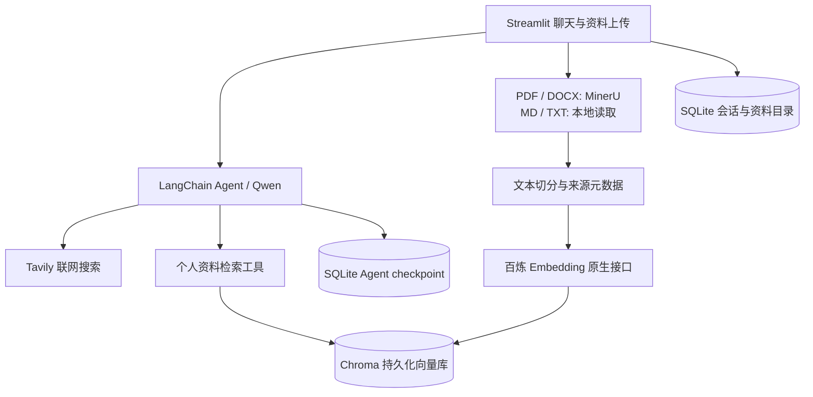

# English Usage Coach｜英语用法学习助手

一个基于 Streamlit 与 LangChain 的英语用法教练：解释自然表达、按需联网核实近期用法、检索上传资料，并在 SQLite 中保存/恢复聊天。

面向英语表达学习的本地单用户 MVP，将多轮问答、个人资料检索和按需联网搜索整合到同一个聊天界面。

### 实际运行效果

以下为本地测试时的真实界面截图。点击 [查看完整演示案例](demo-v1.md)，可阅读日常问答、联网搜索、PDF 检索与多轮上下文的过程、回答节选和复现步骤。

| 根据 PDF 回答并标注来源 | 多轮对话承接上文 |
|---|---|
|  |  |

截图与回答是一次运行的记录；新运行的措辞与检索结果可能不同。可使用仓库自编的 [示例笔记](../examples/english_notes.md) 体验资料检索。

### 项目亮点

- **工具调用**：通过 LangChain Agent 按问题调用个人资料检索或 Tavily 网络搜索，并展示来源。
- **持久化 RAG**：支持 PDF、DOCX、Markdown、TXT，经过解析、切分与向量化写入 Chroma；使用文件哈希去重，入库失败时回滚。
- **会话恢复**：SQLite 分别保存用户可见聊天和 Agent checkpoint，支持切换会话与重启后恢复上下文。
- **接口适配**：Qwen 聊天使用 OpenAI 兼容接口，Embedding 独立适配百炼原生多模态接口。
- **可复现开发**：使用 Python 3.13、uv 锁定依赖；包含离线接口模拟、存储及界面测试。



本仓库提供源代码和本地运行方式。GitHub 仓库链接可供查看实现；当前没有公开在线演示服务。

## 1. 固定方案与功能范围

| 项目 | 本项目方案 |
|---|---|
| Python / 依赖 | Python 3.13；uv + pyproject.toml + uv.lock |
| 页面 | Streamlit，绑定本机 127.0.0.1 |
| 聊天 | qwen3.8-omni-flash；OpenAI-compatible Chat Completions；文本流式输出 |
| Agent | LangChain create_agent；按问题选择工具 |
| Embedding | tongyi-embedding-vision-flash；百炼原生多模态 HTTP API；768 维 |
| PDF / DOCX | MinerU precision，默认 OCR；PDF 按页解析以保留页码 |
| TXT / Markdown | 本地直接读取 UTF-8 文本，不必发送 MinerU |
| 资料索引 | 本地 Chroma，文件哈希去重，入库失败回滚 |
| 聊天存储 | SQLite SqliteSaver 保存 Agent 状态；另一 SQLite 保存界面记录、会话列表和资料目录 |
| 网络搜索 | Tavily 工具；未配置或搜索失败时明确提示 |

当前 UI 是纯文本聊天与文档上传。模型虽然支持多模态，本版索引的是 MinerU 提取的文字，不自动保存图像向量，不提供音视频聊天、发音评分、登录、单词本、学习统计或云部署。

多模态能力不等于知识库。文档仍需解析、切分和向量化，再根据问题检索。聊天模型与 Embedding 模型承担不同任务。

## 2. 最快启动（Windows PowerShell）

下载或克隆本仓库后，在终端进入**包含 `app.py` 和 `pyproject.toml` 的项目根目录**。例如将仓库解压到 `D:\projects\english-usage-coach` 后：

```powershell
cd D:\projects\english-usage-coach
uv sync --locked
Copy-Item .env.example .env
```

`Copy-Item` 只需第一次执行。已有 `.env` 时不要重复覆盖。用 PyCharm/文本编辑器填写 `.env`，然后运行：

```powershell
uv run python check_setup.py
uv run --locked streamlit run app.py
```

浏览器打开 http://localhost:8501 。终端保持运行，结束时按 Ctrl+C。也可以双击项目中的 `start_app.bat`。

首次安装依赖需要联网。当前机器已有 Python 3.13；在其他机器可先执行 `uv python install 3.13`。如果没有 uv，参见 https://docs.astral.sh/uv/getting-started/installation/ 。

不要用 `python app.py` 启动 Streamlit。

## 3. .env 配置

`.env` 放在本目录，与 `pyproject.toml`、`app.py` 同级。它是运行配置，**不要通过页面的资料上传按钮上传**。真实密钥不需要发到聊天里；`.gitignore` 已排除 `.env` 和用户数据。

必须填写的四项：

```dotenv
DASHSCOPE_API_KEY=你的百炼APIKey
DASHSCOPE_BASE_URL=你的业务空间的OpenAI兼容根地址
TAVILY_API_KEY=你的TavilyAPIKey
MINERU_TOKEN=你的MinerU令牌
```

默认模型已填写，不需要另选：

```dotenv
LLM_MODEL=qwen3.8-omni-flash
EMBEDDING_MODEL=tongyi-embedding-vision-flash
EMBEDDING_DIMENSIONS=768
MINERU_MODE=precision
```

### 两种百炼接口的区别

聊天使用 OpenAI 兼容地址，例如控制台提供的 `https://业务空间ID.cn-beijing.maas.aliyuncs.com/compatible-mode/v1`。请复制你自己地域和业务空间的真实地址，不要照抄占位符，也不要附加 `/chat/completions`。

Embedding 使用**原生多模态**路径：

```text
/api/v1/services/embeddings/multimodal-embedding/multimodal-embedding
```

程序仅对官方 `dashscope.aliyuncs.com`、`dashscope-intl.aliyuncs.com`、`dashscope-us.aliyuncs.com` 及业务空间 `*.maas.aliyuncs.com` 主机尝试沿用主机并替换路径。套餐主机、代理和其他主机不做推导。若所在地域/空间提供的原生地址不同，应明确填写完整地址：

```dotenv
DASHSCOPE_EMBEDDING_ENDPOINT=https://你的原生API主机/api/v1/services/embeddings/multimodal-embedding/multimodal-embedding
```

北京旧版公共域名示例为 `https://dashscope.aliyuncs.com/api/v1/services/embeddings/multimodal-embedding/multimodal-embedding`，**不是所有地域通用**。Key 必须有该地域/空间内两个模型的调用权限。套餐专用 Key/地址不能假定支持多模态向量接口。

Embedding 适配在 `english_coach/embeddings.py` 中实现，不使用 `OpenAIEmbeddings`，也无需第二种 Embedding 密钥。`httpx` 直接调用原生 API，因此不必再安装 DashScope SDK。

### 其他设置

`.env.example` 中包含可选项。通常保持默认即可：

- `MINERU_LANGUAGE=en`：默认英语；中文笔记较多时可改 `ch`。
- `MINERU_OCR=true`：precision 模式开启 OCR。
- `MINERU_TIMEOUT=300`：每次 MinerU 解析请求的等待时间，PDF 按页处理总时间可能更长。
- `MAX_UPLOAD_MB=20`：应用层文件大小上限；如提高，还需同步改 `.streamlit/config.toml` 的服务器上限。
- `CHUNK_BYTES=900`：保守 UTF-8 字节长度，不是 token 数。为所选模型的 1024-token 上限留余量。
- `RAG_TOP_K=5`：检索候选片段数。返回候选不保证一定相关，Agent 需判断。
- `DATA_DIR=data`、`UPLOAD_DIR=uploads`：相对项目根目录定位，不受 PyCharm 当前终端位置影响。

配置读取顺序：系统环境变量优先，其次 `.env`。如修改后不生效，检查 PyCharm Run Configuration 中是否设置了同名环境变量。页面点击“重新读取配置”即可更新；必要时停止后重启。

## 4. 在 PyCharm 中打开

1. 打开 PyCharm，选择 **File → Open**（欢迎页可直接 Open）。
2. 选择下载后的项目根目录，作为项目打开；不要只打开 `app.py`。
3. 打开底部 **Terminal**，确认当前目录是该项目，执行 `uv sync --locked`。
4. 设置解释器：**Settings → Project → Python Interpreter → Add Interpreter → Add Local Interpreter**。可使用 uv 环境选项；最直接的方式是选择已有解释器：

   ```text
   <项目根目录>\.venv\Scripts\python.exe
   ```

   不同 PyCharm 版本菜单文字略有差别，目标是选中项目 `.venv` 中的 Python 3.13。
5. 从 `.env.example` 复制得到 `.env`，填写四项配置；不要把密钥写到 Python 代码中。
6. 初次推荐在 Terminal 执行 `uv run --locked streamlit run app.py`。

### 配置绿色运行按钮

**Run → Edit Configurations → ＋ → Python**，填写：

| 字段 | 值 |
|---|---|
| Name | English Coach |
| Run target / Module name | `streamlit`（切换到模块方式，不是脚本路径） |
| Parameters | `run app.py` |
| Working directory | 下载后的项目根目录 |
| Python interpreter | 项目 `.venv\Scripts\python.exe` |

Apply / OK 后点运行。`.env` 由项目自身加载，不需要安装 PyCharm dotenv 插件。

官方 uv 环境说明：https://www.jetbrains.com/help/pycharm/uv.html

## 5. 使用与验收

### 聊天

输入 `What does psych yourself out mean?`，再问“再给一个例句”。AI 应承接上文。新建聊天生成新 thread_id，旧会话仍可在侧栏选择。页面重开默认选最近的会话；SQLite 中的记录与上下文会恢复。

### 搜索

问“这个 slang 在 2026 年还常用吗？”时应看到搜索状态和网页来源。搜索内容是证据，不是全体母语者的频率统计。没有 Tavily Key 或请求失败时不得假装已查到最新资料。

### 上传

选择 PDF / DOCX / MD / TXT 后，点击“导入选中的资料”。PDF/Word 发送到 MinerU 云端解析；提取的文本片段发送到百炼向量化。所有资料在本机资料库中供全部聊天使用。

可以先上传 `examples/english_notes.md`，问“根据 english_notes.md 解释 draw on”。查看回答下方“本轮检索来源”，应显示文件、原文片段；PDF 还显示页码。重复导入同一文件会跳过。

PDF 为保留准确页码采用 MinerU `split_pages=True`，会逐页解析，大文件比一次解析更慢。建议首次先用少量页面。Word/Markdown 无可靠页码时只显示文件和章节，不编造页码。

测试“根据资料解释一个不存在的表达”，回答应说明未找到依据；若补充通用知识，应与资料内容区分。

### 异常恢复

入库失败不计入成功资料目录，并删除本次写入的片段；原文件和已解析文本保留用于重试。聊天失败会标注错误，丢弃半截工具状态；下轮从已完成对话重建上下文，不自动重新收费调用。

## 6. 文件结构与每个文件的作用

```text
english_ai_app/
├── app.py                       Streamlit 界面、上传、聊天显示、来源展开
├── check_setup.py               离线检查 Python/包版本/配置是否填写，不调用 API
├── start_app.bat                Windows 双击启动入口
├── pyproject.toml               Python 版本范围、依赖、开发工具配置
├── uv.lock                      锁定已解析的依赖版本
├── .python-version              指定 Python 3.13
├── .env.example                 无真实密钥的配置模板
├── .env                         用户填写的配置（自行复制创建，不提交）
├── .gitignore                   排除密钥、用户数据、虚拟环境和缓存
├── .streamlit/config.toml       本机监听、上传上限、界面配色
├── english_coach/
│   ├── __init__.py              Python 包入口
│   ├── config.py                环境配置、路径、参数校验、脱敏错误提示
│   ├── embeddings.py            原生多模态 Embedding → LangChain 适配
│   ├── knowledge.py             文档加载/缓存/切分/去重/Chroma 入库与检索
│   ├── storage.py               会话列表、界面记录和资料目录的 SQLite 操作
│   ├── prompts.py               英语教学、工具选择、引用和不确定性规则
│   ├── tools.py                 search_materials、web_search 工具及来源收集
│   └── runtime.py               create_agent、流式调用、checkpointer、失败恢复
├── examples/english_notes.md    自编的示例资料，可通过界面上传
├── docs/
│   ├── demo.md                 真实截图、回答节选、来源与复现步骤
│   └── screenshots/            8 张实际运行截图
├── tests/
│   ├── __init__.py              测试包入口
│   ├── conftest.py              临时目录和离线 Embedding 测试替身
│   ├── test_config_embeddings.py 配置、接口格式、批次、响应验证和错误脱敏
│   ├── test_knowledge.py        切分、来源、重复入库、回滚和 MinerU 接入
│   ├── test_agent_ui.py         Agent 工具循环、SQLite 恢复、会话隔离与界面
│   └── test_http_tools.py       OpenAI 兼容流式请求、工具循环与 Tavily 来源处理
├── README.md                    本操作说明
├── .venv/                       uv 管理的解释器和依赖
├── uploads/                     运行时保存原始文件（哈希命名）
└── data/                        运行时生成
    ├── catalog.sqlite           用户可见会话/消息/资料目录
    ├── checkpoints.sqlite       Agent 消息、工具调用与内部状态
    ├── index_config.json        防止混用不同模型或切分配置的索引
    ├── parsed/                  MinerU/文本解析结果缓存
    └── chroma/                  向量、文本片段、元数据
```

界面历史与 Agent 内部状态故意分开：页面只展示最终回答和来源，不直接显示工具 JSON。完整备份时，停止应用后一起复制 `data/` 和 `uploads/`；密钥另行保存。

更改 Embedding 模型/维度或切分参数时，系统会阻止复用旧索引。MVP 最简单的重建方式是设置新的 `DATA_DIR` 后重启并重新上传；该目录也包含聊天数据库，因此旧聊天仍保留在原目录但不会出现在新目录的页面中。

## 7. 开发检查与已知边界

```powershell
uv run pytest -q
uv run ruff check .
uv run python check_setup.py
```

测试使用临时 SQLite/Chroma、模拟 HTTP 和模拟聊天模型，不需要 Key、不访问外网，也不把模拟模型接入产品页面。真实百炼、MinerU、Tavily 的账号权限、额度、网络和最终教学质量，要在填写 `.env` 后验证。

2026-09-28 本地交付检查：Python 3.13.15 环境安装完成；22 项测试通过；Ruff 检查与格式检查通过；Streamlit 本地启动成功，首页及 `/_stcore/health` 均返回 HTTP 200。未执行真实外部服务调用。

本版面向本机单用户。不要直接把服务公开到互联网。长聊天仍受模型上下文限制，本版未加入自动摘要；可以新建聊天继续。使用多模态 Embedding 不保证效果优于文本专用模型，需要以实际资料检索效果判断。

## 8. 与参考材料的对应

- 父目录 `app/agents/personal_cheif.py`：借鉴 `init_chat_model`、`create_agent`、Tavily、SqliteSaver、thread_id、流式输出的组织方式；没有移植 FastAPI 或 OSS。
- 父目录《第1节 RAG Agent.md》：借鉴 MinerULoader、标题/递归切分、向量化、检索工具封装；内存向量库替换为持久化 Chroma，Embedding 替换为你指定型号的原生接口适配。
- 父目录英语构想 MD：保留 Native English Usage Coach 定位、按需搜索、上传资料与会话上下文；按后续讨论改用 SQLite 持久化。

接口核对资料：

- https://help.aliyun.com/zh/model-studio/qwen-omni
- https://help.aliyun.com/zh/model-studio/qwen-function-calling
- https://help.aliyun.com/zh/model-studio/multimodal-embedding-api-reference
- https://pypi.org/project/langchain-mineru/
- https://docs.langchain.com/oss/python/integrations/vectorstores/chroma
- https://reference.langchain.com/python/langgraph.checkpoint.sqlite/SqliteSaver
- https://docs.astral.sh/uv/guides/projects/

同时对照本地百炼技能原文 `raw/model-api-reference/vector-and-sort/multimodal-vector/multimodal-embedding-api-reference.md`。
